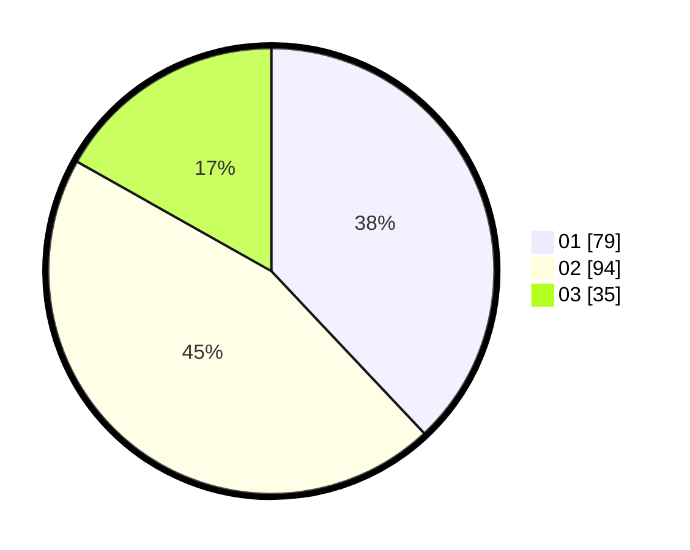

# Hasil

Hasil perolehan suara paslon dapat dilihat pada file paslon-01.txt, paslon-02.txt, dan paslon-03.txt.

Jika tidak ada, artinya data tersebut belum ada pada SIREKAP.

## Perolehan Suara

 * Paslon 01: **79**.
 * Paslon 02: **94**.
 * Paslon 03: **35**.

## Foto C Plano

https://sirekap-obj-formc.kpu.go.id/d675/pemilu/ppwp/31/73/02/10/03/3173021003049-20240216-013108--96127832-9c52-4cc1-beb7-785c4af0eaa6.jpg

https://sirekap-obj-formc.kpu.go.id/d675/pemilu/ppwp/31/73/02/10/03/3173021003049-20240216-013117--586dd7a5-a558-44ff-9599-78a416bb34e4.jpg

https://sirekap-obj-formc.kpu.go.id/d675/pemilu/ppwp/31/73/02/10/03/3173021003049-20240216-013112--71c48279-d843-49e5-84a0-7aa67d2f0c51.jpg

## DATA PEMILIH TETAP

Jumlah pemilih dalam DPT: **267**.
 * L: **145**.
 * P: **122**.

## DATA PENGGUNA HAK PILIH

Jumlah pengguna hak pilih dalam DPT: **207**.
 * L: **113**.
 * P: **94**.

Jumlah pengguna hak pilih dalam DPTb: **4**.
 * L: **3**.
 * P: **1**.

Jumlah pengguna hak pilih dalam DPK: **0**.
 * L: **0**.
 * P: **0**.

Jumlah pengguna hak pilih: **211**.
 * L: **116**.
 * P: **95**.

## JUMLAH SUARA SAH DAN TIDAK SAH

JUMLAH SELURUH SUARA SAH: **208**.

JUMLAH SUARA TIDAK SAH: **3**.

JUMLAH SELURUH SUARA SAH DAN SUARA TIDAK SAH: **211**.
