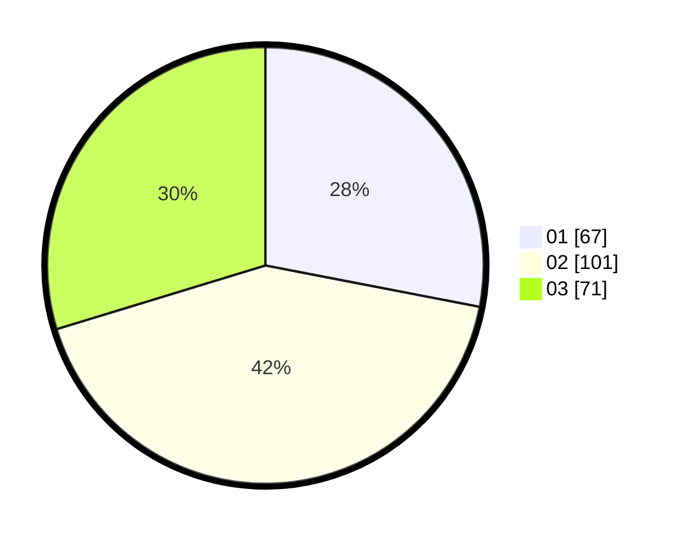

# Hasil

Hasil perolehan suara paslon dapat dilihat pada file paslon-01.txt, paslon-02.txt, dan paslon-03.txt.

Jika tidak ada, artinya data tersebut belum ada pada SIREKAP.

## Perolehan Suara

 * Paslon 01: **67**.
 * Paslon 02: **101**.
 * Paslon 03: **71**.

## Foto C Plano

https://sirekap-obj-formc.kpu.go.id/32f7/pemilu/ppwp/31/73/02/10/03/3173021003051-20240215-020826--146515ca-38f7-4333-94cf-e79ac1cf7d63.jpg

https://sirekap-obj-formc.kpu.go.id/32f7/pemilu/ppwp/31/73/02/10/03/3173021003051-20240215-021035--99e96dbd-4100-4747-84b6-1010b25e03b8.jpg

https://sirekap-obj-formc.kpu.go.id/32f7/pemilu/ppwp/31/73/02/10/03/3173021003051-20240215-021219--e5b785f0-9d2d-4baa-897a-9a65f8e9c201.jpg

## DATA PEMILIH TETAP

Jumlah pemilih dalam DPT: **267**.
 * L: **119**.
 * P: **148**.

## DATA PENGGUNA HAK PILIH

Jumlah pengguna hak pilih dalam DPT: **223**.
 * L: **97**.
 * P: **126**.

Jumlah pengguna hak pilih dalam DPTb: **16**.
 * L: **5**.
 * P: **11**.

Jumlah pengguna hak pilih dalam DPK: **5**.
 * L: **4**.
 * P: **1**.

Jumlah pengguna hak pilih: **244**.
 * L: **106**.
 * P: **138**.

## JUMLAH SUARA SAH DAN TIDAK SAH

JUMLAH SELURUH SUARA SAH: **239**.

JUMLAH SUARA TIDAK SAH: **5**.

JUMLAH SELURUH SUARA SAH DAN SUARA TIDAK SAH: **244**.
