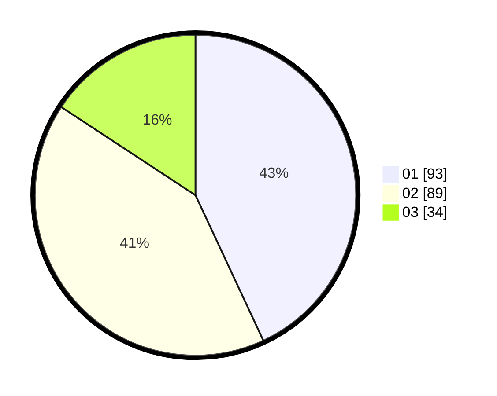

# Hasil

Hasil perolehan suara paslon dapat dilihat pada file paslon-01.txt, paslon-02.txt, dan paslon-03.txt.

Jika tidak ada, artinya data tersebut belum ada pada SIREKAP.

## Perolehan Suara

 * Paslon 01: **93**.
 * Paslon 02: **89**.
 * Paslon 03: **34**.

## Foto C Plano

https://sirekap-obj-formc.kpu.go.id/3195/pemilu/ppwp/31/73/02/10/03/3173021003054-20240216-133943--366c42ab-9009-4488-b724-4c05769bbfbb.jpg

https://sirekap-obj-formc.kpu.go.id/3195/pemilu/ppwp/31/73/02/10/03/3173021003054-20240216-133944--d0f7e3cb-0950-47f4-b8a9-31028757109a.jpg

https://sirekap-obj-formc.kpu.go.id/3195/pemilu/ppwp/31/73/02/10/03/3173021003054-20240216-133944--5e8e6384-beb7-4a71-adbf-b058bce95fba.jpg

## DATA PEMILIH TETAP

Jumlah pemilih dalam DPT: **274**.
 * L: **133**.
 * P: **141**.

## DATA PENGGUNA HAK PILIH

Jumlah pengguna hak pilih dalam DPT: **206**.
 * L: **90**.
 * P: **116**.

Jumlah pengguna hak pilih dalam DPTb: **8**.
 * L: **3**.
 * P: **5**.

Jumlah pengguna hak pilih dalam DPK: **2**.
 * L: **2**.
 * P: **0**.

Jumlah pengguna hak pilih: **216**.
 * L: **96**.
 * P: **120**.

## JUMLAH SUARA SAH DAN TIDAK SAH

JUMLAH SELURUH SUARA SAH: **216**.

JUMLAH SUARA TIDAK SAH: **0**.

JUMLAH SELURUH SUARA SAH DAN SUARA TIDAK SAH: **216**.
