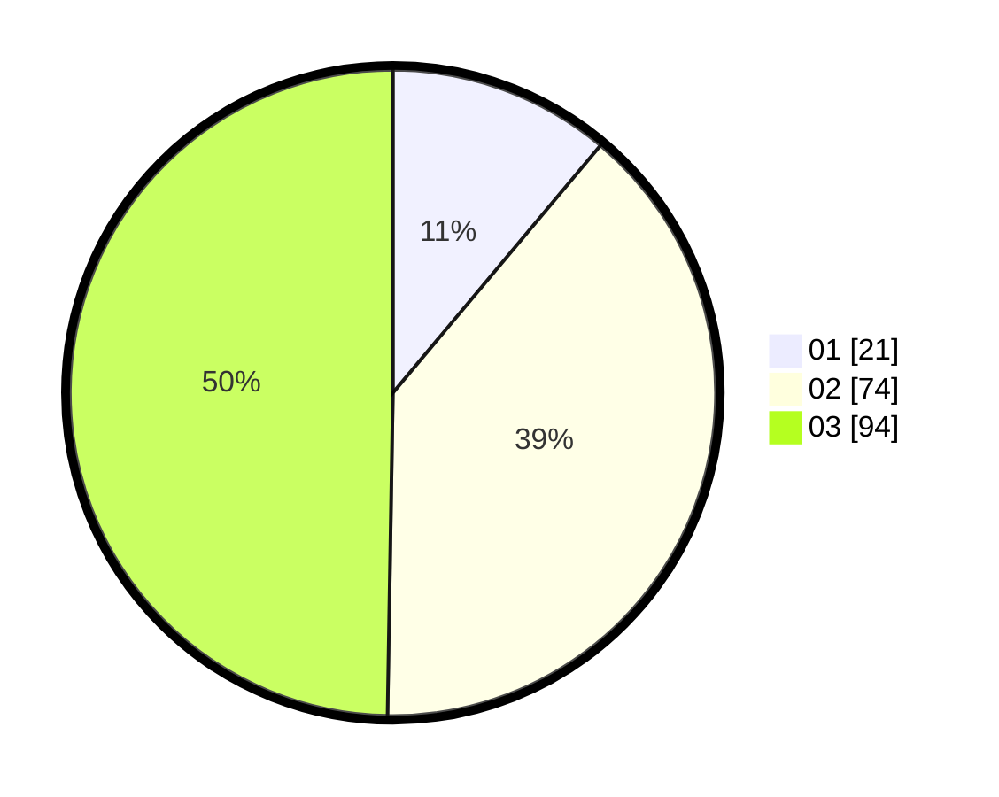

# Hasil

Hasil perolehan suara paslon dapat dilihat pada file paslon-01.txt, paslon-02.txt, dan paslon-03.txt.

Jika tidak ada, artinya data tersebut belum ada pada SIREKAP.

## Perolehan Suara

 * Paslon 01: **21**.
 * Paslon 02: **74**.
 * Paslon 03: **94**.

## Foto C Plano

https://sirekap-obj-formc.kpu.go.id/9399/pemilu/ppwp/31/73/02/10/03/3173021003056-20240216-144539--409178cb-3b6a-4790-9b74-128a9c7b84ba.jpg

https://sirekap-obj-formc.kpu.go.id/9399/pemilu/ppwp/31/73/02/10/03/3173021003056-20240216-144541--c886af36-a738-4d19-b8ef-c61f1b935a20.jpg

https://sirekap-obj-formc.kpu.go.id/9399/pemilu/ppwp/31/73/02/10/03/3173021003056-20240216-144540--8cecb033-2e27-4235-a8f8-facefa7d71d2.jpg

## DATA PEMILIH TETAP

Jumlah pemilih dalam DPT: **259**.
 * L: **119**.
 * P: **140**.

## DATA PENGGUNA HAK PILIH

Jumlah pengguna hak pilih dalam DPT: **173**.
 * L: **80**.
 * P: **93**.

Jumlah pengguna hak pilih dalam DPTb: **9**.
 * L: **4**.
 * P: **5**.

Jumlah pengguna hak pilih dalam DPK: **8**.
 * L: **5**.
 * P: **3**.

Jumlah pengguna hak pilih: **190**.
 * L: **89**.
 * P: **101**.

## JUMLAH SUARA SAH DAN TIDAK SAH

JUMLAH SELURUH SUARA SAH: **189**.

JUMLAH SUARA TIDAK SAH: **1**.

JUMLAH SELURUH SUARA SAH DAN SUARA TIDAK SAH: **190**.
