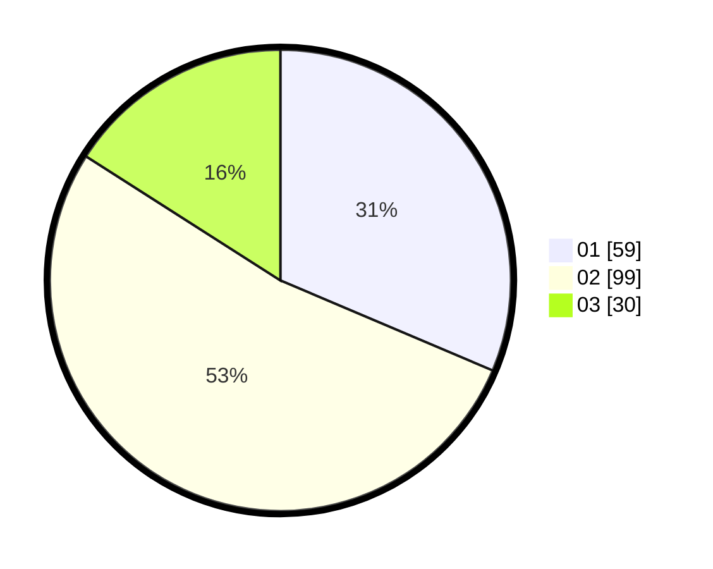

# Hasil

Hasil perolehan suara paslon dapat dilihat pada file paslon-01.txt, paslon-02.txt, dan paslon-03.txt.

Jika tidak ada, artinya data tersebut belum ada pada SIREKAP.

## Perolehan Suara

 * Paslon 01: **59**.
 * Paslon 02: **99**.
 * Paslon 03: **30**.

## Foto C Plano

https://sirekap-obj-formc.kpu.go.id/ae9d/pemilu/ppwp/31/73/02/10/03/3173021003057-20240216-144808--f769fcbf-55bf-4997-ab3e-856d34ea46cb.jpg

https://sirekap-obj-formc.kpu.go.id/ae9d/pemilu/ppwp/31/73/02/10/03/3173021003057-20240216-144809--4a5914fd-b1c5-474f-a7b0-313ebbb88843.jpg

https://sirekap-obj-formc.kpu.go.id/ae9d/pemilu/ppwp/31/73/02/10/03/3173021003057-20240216-144808--ca92b3e6-a811-4b61-9adc-0f5cc6a31886.jpg

## DATA PEMILIH TETAP

Jumlah pemilih dalam DPT: **235**.
 * L: **113**.
 * P: **122**.

## DATA PENGGUNA HAK PILIH

Jumlah pengguna hak pilih dalam DPT: **170**.
 * L: **82**.
 * P: **88**.

Jumlah pengguna hak pilih dalam DPTb: **19**.
 * L: **7**.
 * P: **12**.

Jumlah pengguna hak pilih dalam DPK: **5**.
 * L: **3**.
 * P: **2**.

Jumlah pengguna hak pilih: **194**.
 * L: **92**.
 * P: **102**.

## JUMLAH SUARA SAH DAN TIDAK SAH

JUMLAH SELURUH SUARA SAH: **188**.

JUMLAH SUARA TIDAK SAH: **6**.

JUMLAH SELURUH SUARA SAH DAN SUARA TIDAK SAH: **194**.
