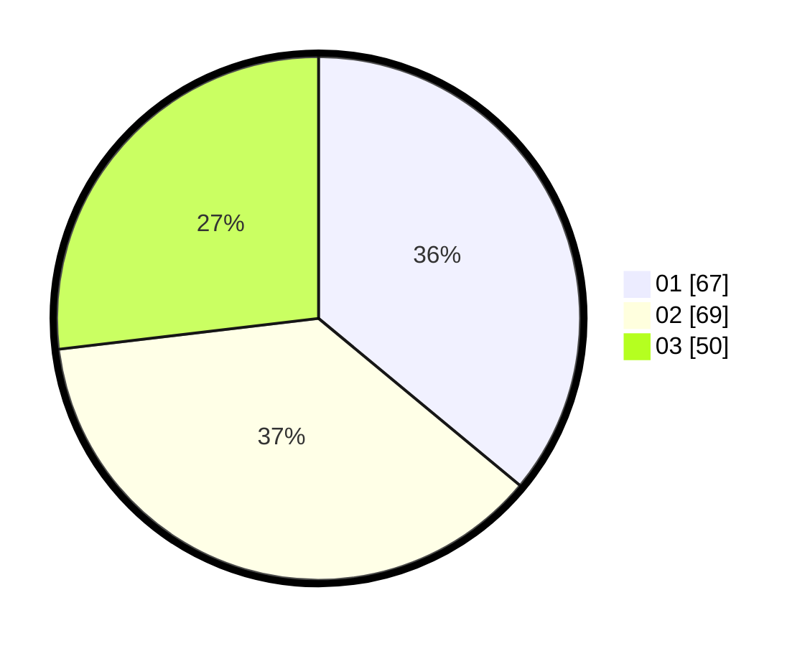

# Hasil

Hasil perolehan suara paslon dapat dilihat pada file paslon-01.txt, paslon-02.txt, dan paslon-03.txt.

Jika tidak ada, artinya data tersebut belum ada pada SIREKAP.

## Perolehan Suara

 * Paslon 01: **67**.
 * Paslon 02: **69**.
 * Paslon 03: **50**.

## Foto C Plano

https://sirekap-obj-formc.kpu.go.id/63e9/pemilu/ppwp/31/73/02/10/03/3173021003058-20240216-133715--df1460da-dc02-461d-8403-7fff35f36f5c.jpg

https://sirekap-obj-formc.kpu.go.id/63e9/pemilu/ppwp/31/73/02/10/03/3173021003058-20240216-133718--00299f87-bbf3-4fa5-a4f3-d15779c4af42.jpg

https://sirekap-obj-formc.kpu.go.id/63e9/pemilu/ppwp/31/73/02/10/03/3173021003058-20240216-133717--83af2907-7403-4ca3-a0bf-0bb718902d74.jpg

## DATA PEMILIH TETAP

Jumlah pemilih dalam DPT: **233**.
 * L: **116**.
 * P: **117**.

## DATA PENGGUNA HAK PILIH

Jumlah pengguna hak pilih dalam DPT: **173**.
 * L: **84**.
 * P: **89**.

Jumlah pengguna hak pilih dalam DPTb: **12**.
 * L: **0**.
 * P: **12**.

Jumlah pengguna hak pilih dalam DPK: **3**.
 * L: **1**.
 * P: **2**.

Jumlah pengguna hak pilih: **188**.
 * L: **85**.
 * P: **103**.

## JUMLAH SUARA SAH DAN TIDAK SAH

JUMLAH SELURUH SUARA SAH: **188**.

JUMLAH SUARA TIDAK SAH: **2**.

JUMLAH SELURUH SUARA SAH DAN SUARA TIDAK SAH: **190**.
