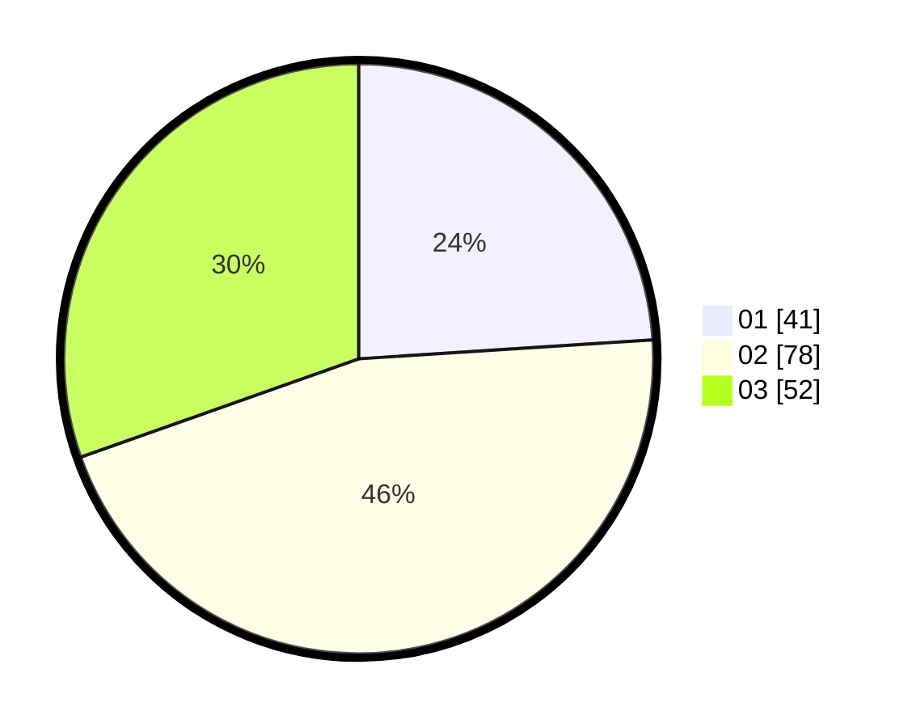

# Hasil

Hasil perolehan suara paslon dapat dilihat pada file paslon-01.txt, paslon-02.txt, dan paslon-03.txt.

Jika tidak ada, artinya data tersebut belum ada pada SIREKAP.

## Perolehan Suara

 * Paslon 01: **41**.
 * Paslon 02: **78**.
 * Paslon 03: **52**.

## Foto C Plano

https://sirekap-obj-formc.kpu.go.id/4784/pemilu/ppwp/31/73/02/10/03/3173021003060-20240215-222110--00fa8d06-dc86-474f-8077-e8deb7866e29.jpg

https://sirekap-obj-formc.kpu.go.id/4784/pemilu/ppwp/31/73/02/10/03/3173021003060-20240215-222112--08edcd48-cd37-458b-ab94-275fc7b9d780.jpg

https://sirekap-obj-formc.kpu.go.id/4784/pemilu/ppwp/31/73/02/10/03/3173021003060-20240215-222111--24194ec9-3ab9-4600-aa0b-68b872ef076c.jpg

## DATA PEMILIH TETAP

Jumlah pemilih dalam DPT: **223**.
 * L: **103**.
 * P: **120**.

## DATA PENGGUNA HAK PILIH

Jumlah pengguna hak pilih dalam DPT: **159**.
 * L: **75**.
 * P: **84**.

Jumlah pengguna hak pilih dalam DPTb: **15**.
 * L: **7**.
 * P: **8**.

Jumlah pengguna hak pilih dalam DPK: **4**.
 * L: **0**.
 * P: **4**.

Jumlah pengguna hak pilih: **178**.
 * L: **82**.
 * P: **96**.

## JUMLAH SUARA SAH DAN TIDAK SAH

JUMLAH SELURUH SUARA SAH: **171**.

JUMLAH SUARA TIDAK SAH: **7**.

JUMLAH SELURUH SUARA SAH DAN SUARA TIDAK SAH: **178**.
