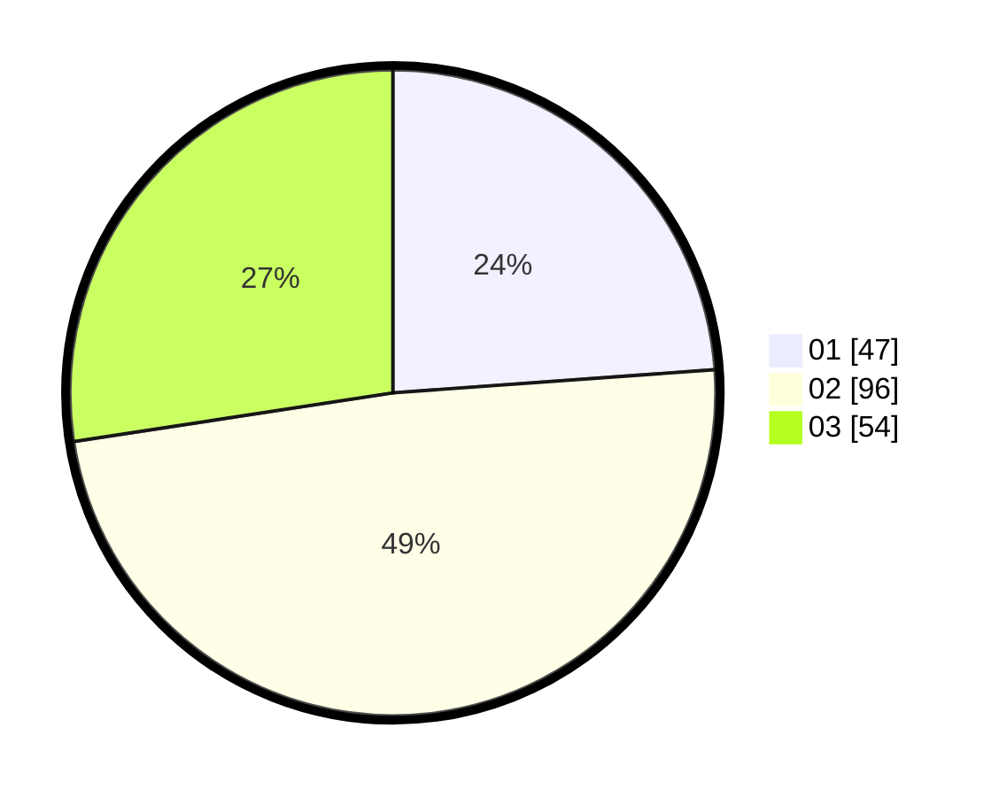

# Hasil

Hasil perolehan suara paslon dapat dilihat pada file paslon-01.txt, paslon-02.txt, dan paslon-03.txt.

Jika tidak ada, artinya data tersebut belum ada pada SIREKAP.

## Perolehan Suara

 * Paslon 01: **47**.
 * Paslon 02: **96**.
 * Paslon 03: **54**.

## Foto C Plano

https://sirekap-obj-formc.kpu.go.id/634b/pemilu/ppwp/31/73/02/10/03/3173021003061-20240215-235905--227a9bf3-695c-43a7-badf-f6fe093e7028.jpg

https://sirekap-obj-formc.kpu.go.id/634b/pemilu/ppwp/31/73/02/10/03/3173021003061-20240215-235907--1f7f14c6-7f82-428b-a7bc-50a2c12ddfd8.jpg

https://sirekap-obj-formc.kpu.go.id/634b/pemilu/ppwp/31/73/02/10/03/3173021003061-20240215-235906--563f58af-7437-4988-a821-15745633353b.jpg

## DATA PEMILIH TETAP

Jumlah pemilih dalam DPT: **225**.
 * L: **118**.
 * P: **107**.

## DATA PENGGUNA HAK PILIH

Jumlah pengguna hak pilih dalam DPT: **177**.
 * L: **90**.
 * P: **87**.

Jumlah pengguna hak pilih dalam DPTb: **20**.
 * L: **2**.
 * P: **18**.

Jumlah pengguna hak pilih dalam DPK: **2**.
 * L: **1**.
 * P: **1**.

Jumlah pengguna hak pilih: **199**.
 * L: **93**.
 * P: **106**.

## JUMLAH SUARA SAH DAN TIDAK SAH

JUMLAH SELURUH SUARA SAH: **197**.

JUMLAH SUARA TIDAK SAH: **2**.

JUMLAH SELURUH SUARA SAH DAN SUARA TIDAK SAH: **199**.
