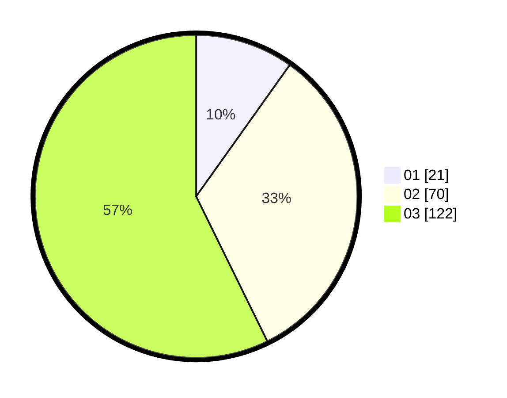

# Hasil

Hasil perolehan suara paslon dapat dilihat pada file paslon-01.txt, paslon-02.txt, dan paslon-03.txt.

Jika tidak ada, artinya data tersebut belum ada pada SIREKAP.

## Perolehan Suara

 * Paslon 01: **21**.
 * Paslon 02: **70**.
 * Paslon 03: **122**.

## Foto C Plano

https://sirekap-obj-formc.kpu.go.id/7ae3/pemilu/ppwp/31/73/02/10/03/3173021003064-20240214-163519--2aec7c6d-4928-4759-af9b-43861e31ccf0.jpg

https://sirekap-obj-formc.kpu.go.id/7ae3/pemilu/ppwp/31/73/02/10/03/3173021003064-20240214-163520--93e86929-f327-4701-ab6c-abfeeab2ed7d.jpg

https://sirekap-obj-formc.kpu.go.id/7ae3/pemilu/ppwp/31/73/02/10/03/3173021003064-20240214-163519--94ef4441-a74c-477f-b4e8-2a4b5cd763ef.jpg

## DATA PEMILIH TETAP

Jumlah pemilih dalam DPT: **272**.
 * L: **120**.
 * P: **152**.

## DATA PENGGUNA HAK PILIH

Jumlah pengguna hak pilih dalam DPT: **198**.
 * L: **87**.
 * P: **111**.

Jumlah pengguna hak pilih dalam DPTb: **16**.
 * L: **0**.
 * P: **16**.

Jumlah pengguna hak pilih dalam DPK: **0**.
 * L: **0**.
 * P: **0**.

Jumlah pengguna hak pilih: **214**.
 * L: **87**.
 * P: **127**.

## JUMLAH SUARA SAH DAN TIDAK SAH

JUMLAH SELURUH SUARA SAH: **213**.

JUMLAH SUARA TIDAK SAH: **1**.

JUMLAH SELURUH SUARA SAH DAN SUARA TIDAK SAH: **214**.
