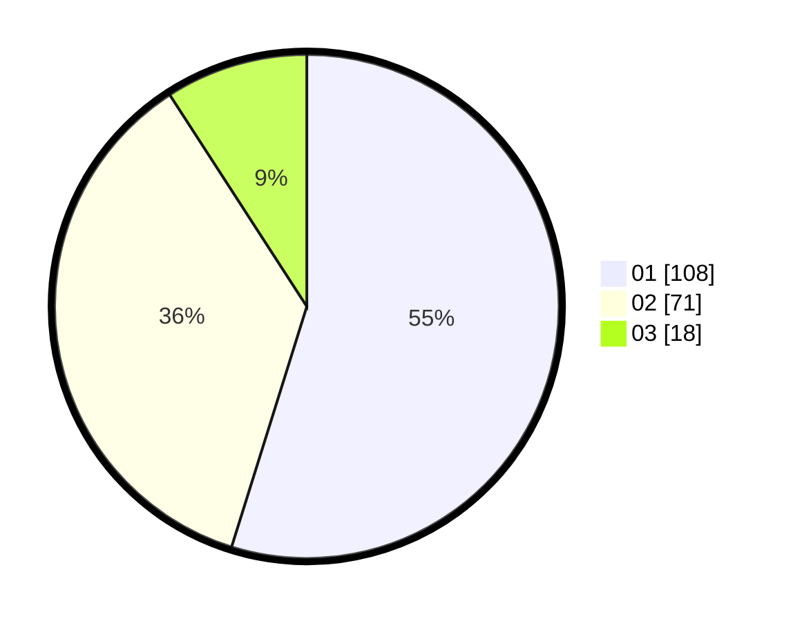

# Hasil

Hasil perolehan suara paslon dapat dilihat pada file paslon-01.txt, paslon-02.txt, dan paslon-03.txt.

Jika tidak ada, artinya data tersebut belum ada pada SIREKAP.

## Perolehan Suara

 * Paslon 01: **108**.
 * Paslon 02: **71**.
 * Paslon 03: **18**.

## Foto C Plano

https://sirekap-obj-formc.kpu.go.id/9b69/pemilu/ppwp/31/73/02/10/03/3173021003068-20240216-151249--db1e7265-d490-4f61-933f-158594721c87.jpg

https://sirekap-obj-formc.kpu.go.id/9b69/pemilu/ppwp/31/73/02/10/03/3173021003068-20240216-151250--b8729585-79bf-415d-aec7-f1d57295e4ed.jpg

https://sirekap-obj-formc.kpu.go.id/9b69/pemilu/ppwp/31/73/02/10/03/3173021003068-20240216-151250--5b9f1313-5172-4b9e-9343-3e265ff3d8f2.jpg

## DATA PEMILIH TETAP

Jumlah pemilih dalam DPT: **263**.
 * L: **133**.
 * P: **130**.

## DATA PENGGUNA HAK PILIH

Jumlah pengguna hak pilih dalam DPT: **190**.
 * L: **90**.
 * P: **100**.

Jumlah pengguna hak pilih dalam DPTb: **8**.
 * L: **3**.
 * P: **5**.

Jumlah pengguna hak pilih dalam DPK: **2**.
 * L: **1**.
 * P: **1**.

Jumlah pengguna hak pilih: **200**.
 * L: **94**.
 * P: **106**.

## JUMLAH SUARA SAH DAN TIDAK SAH

JUMLAH SELURUH SUARA SAH: **197**.

JUMLAH SUARA TIDAK SAH: **3**.

JUMLAH SELURUH SUARA SAH DAN SUARA TIDAK SAH: **200**.
