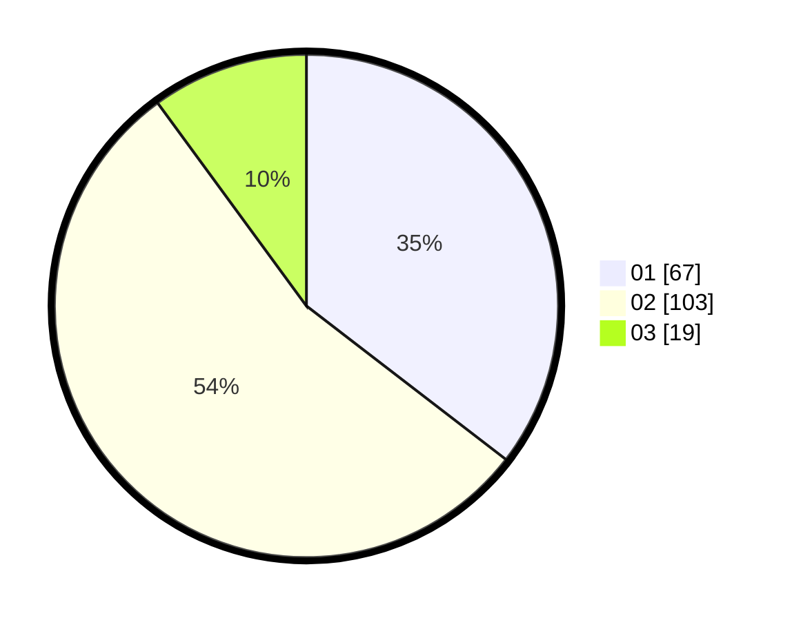

# Hasil

Hasil perolehan suara paslon dapat dilihat pada file paslon-01.txt, paslon-02.txt, dan paslon-03.txt.

Jika tidak ada, artinya data tersebut belum ada pada SIREKAP.

## Perolehan Suara

 * Paslon 01: **67**.
 * Paslon 02: **103**.
 * Paslon 03: **19**.

## Foto C Plano

https://sirekap-obj-formc.kpu.go.id/f5a3/pemilu/ppwp/31/73/02/10/03/3173021003070-20240216-055700--e09c8e07-11f0-4cd4-91b2-32959fb89936.jpg

https://sirekap-obj-formc.kpu.go.id/f5a3/pemilu/ppwp/31/73/02/10/03/3173021003070-20240216-054131--592e3c0b-6153-4f73-8d88-9eac39c5f89e.jpg

https://sirekap-obj-formc.kpu.go.id/f5a3/pemilu/ppwp/31/73/02/10/03/3173021003070-20240216-054122--0bef67cb-194c-4e5e-8332-1189a0220025.jpg

## DATA PEMILIH TETAP

Jumlah pemilih dalam DPT: **243**.
 * L: **124**.
 * P: **119**.

## DATA PENGGUNA HAK PILIH

Jumlah pengguna hak pilih dalam DPT: **191**.
 * L: **92**.
 * P: **99**.

Jumlah pengguna hak pilih dalam DPTb: **4**.
 * L: **1**.
 * P: **3**.

Jumlah pengguna hak pilih dalam DPK: **0**.
 * L: **0**.
 * P: **0**.

Jumlah pengguna hak pilih: **195**.
 * L: **93**.
 * P: **102**.

## JUMLAH SUARA SAH DAN TIDAK SAH

JUMLAH SELURUH SUARA SAH: **189**.

JUMLAH SUARA TIDAK SAH: **6**.

JUMLAH SELURUH SUARA SAH DAN SUARA TIDAK SAH: **195**.
