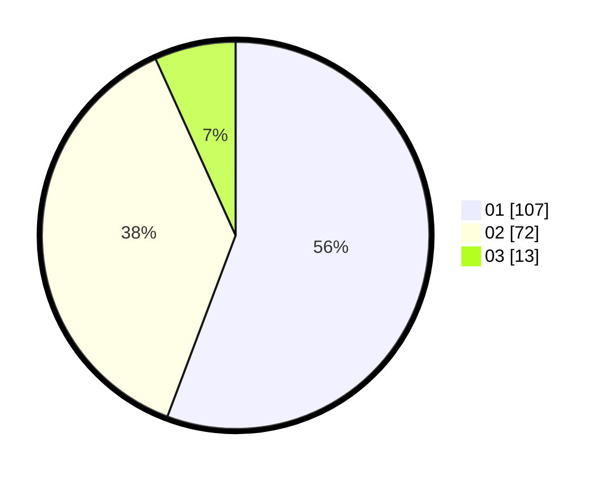

# Hasil

Hasil perolehan suara paslon dapat dilihat pada file paslon-01.txt, paslon-02.txt, dan paslon-03.txt.

Jika tidak ada, artinya data tersebut belum ada pada SIREKAP.

## Perolehan Suara

 * Paslon 01: **107**.
 * Paslon 02: **72**.
 * Paslon 03: **13**.

## Foto C Plano

https://sirekap-obj-formc.kpu.go.id/71f9/pemilu/ppwp/31/73/02/10/03/3173021003076-20240214-185003--d745c68d-c08e-479b-8fe3-c46fb1d62b14.jpg

https://sirekap-obj-formc.kpu.go.id/71f9/pemilu/ppwp/31/73/02/10/03/3173021003076-20240214-185026--ba45bf44-89be-454f-8a1d-d750d241ee27.jpg

https://sirekap-obj-formc.kpu.go.id/71f9/pemilu/ppwp/31/73/02/10/03/3173021003076-20240216-004907--1b320c50-1656-470a-ac97-f6f708767b62.jpg

## DATA PEMILIH TETAP

Jumlah pemilih dalam DPT: **240**.
 * L: **124**.
 * P: **116**.

## DATA PENGGUNA HAK PILIH

Jumlah pengguna hak pilih dalam DPT: **196**.
 * L: **97**.
 * P: **99**.

Jumlah pengguna hak pilih dalam DPTb: **0**.
 * L: **0**.
 * P: **0**.

Jumlah pengguna hak pilih dalam DPK: **0**.
 * L: **0**.
 * P: **0**.

Jumlah pengguna hak pilih: **196**.
 * L: **97**.
 * P: **99**.

## JUMLAH SUARA SAH DAN TIDAK SAH

JUMLAH SELURUH SUARA SAH: **192**.

JUMLAH SUARA TIDAK SAH: **4**.

JUMLAH SELURUH SUARA SAH DAN SUARA TIDAK SAH: **196**.
