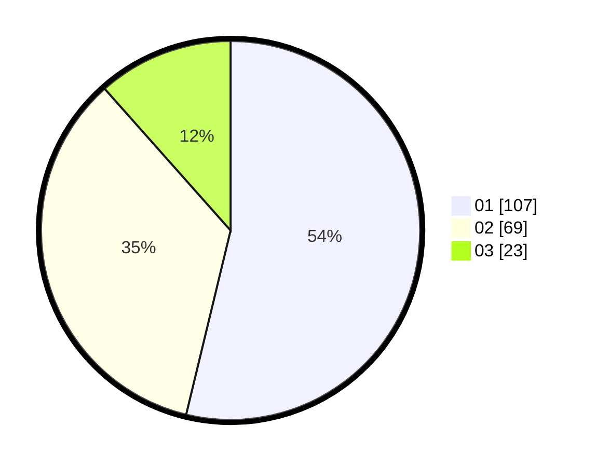

# Hasil

Hasil perolehan suara paslon dapat dilihat pada file paslon-01.txt, paslon-02.txt, dan paslon-03.txt.

Jika tidak ada, artinya data tersebut belum ada pada SIREKAP.

## Perolehan Suara

 * Paslon 01: **107**.
 * Paslon 02: **69**.
 * Paslon 03: **23**.

## Foto C Plano

https://sirekap-obj-formc.kpu.go.id/482b/pemilu/ppwp/31/73/02/10/03/3173021003078-20240219-002806--c482977b-cab8-41ad-8961-3bacd5b386fb.jpg

https://sirekap-obj-formc.kpu.go.id/482b/pemilu/ppwp/31/73/02/10/03/3173021003078-20240219-002807--f68d631c-b6bd-452c-96b4-d3d1a8c6449b.jpg

https://sirekap-obj-formc.kpu.go.id/482b/pemilu/ppwp/31/73/02/10/03/3173021003078-20240219-002806--5774fed8-d9b4-4f0f-85d6-3456b623b770.jpg

## DATA PEMILIH TETAP

Jumlah pemilih dalam DPT: **240**.
 * L: **117**.
 * P: **123**.

## DATA PENGGUNA HAK PILIH

Jumlah pengguna hak pilih dalam DPT: **194**.
 * L: **93**.
 * P: **101**.

Jumlah pengguna hak pilih dalam DPTb: **3**.
 * L: **0**.
 * P: **3**.

Jumlah pengguna hak pilih dalam DPK: **6**.
 * L: **3**.
 * P: **3**.

Jumlah pengguna hak pilih: **203**.
 * L: **95**.
 * P: **108**.

## JUMLAH SUARA SAH DAN TIDAK SAH

JUMLAH SELURUH SUARA SAH: **199**.

JUMLAH SUARA TIDAK SAH: **4**.

JUMLAH SELURUH SUARA SAH DAN SUARA TIDAK SAH: **203**.
