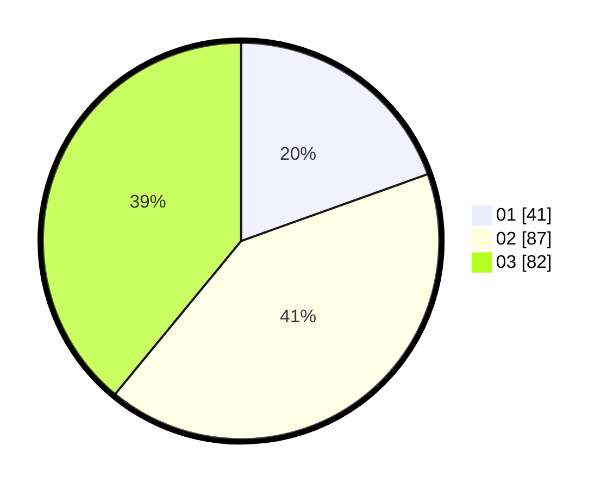

# Hasil

Hasil perolehan suara paslon dapat dilihat pada file paslon-01.txt, paslon-02.txt, dan paslon-03.txt.

Jika tidak ada, artinya data tersebut belum ada pada SIREKAP.

## Perolehan Suara

 * Paslon 01: **41**.
 * Paslon 02: **87**.
 * Paslon 03: **82**.

## Foto C Plano

https://sirekap-obj-formc.kpu.go.id/57c5/pemilu/ppwp/31/73/02/10/03/3173021003080-20240216-063549--7f5fb959-6a3b-476d-84c0-3354dbc98a64.jpg

https://sirekap-obj-formc.kpu.go.id/57c5/pemilu/ppwp/31/73/02/10/03/3173021003080-20240214-160054--23b31319-623e-4cac-9cd9-fedb595e3416.jpg

https://sirekap-obj-formc.kpu.go.id/57c5/pemilu/ppwp/31/73/02/10/03/3173021003080-20240214-160129--e29ce7a0-0ac8-4ff7-9d15-044c4399c5a8.jpg

## DATA PEMILIH TETAP

Jumlah pemilih dalam DPT: **267**.
 * L: **126**.
 * P: **141**.

## DATA PENGGUNA HAK PILIH

Jumlah pengguna hak pilih dalam DPT: **198**.
 * L: **92**.
 * P: **106**.

Jumlah pengguna hak pilih dalam DPTb: **11**.
 * L: **1**.
 * P: **10**.

Jumlah pengguna hak pilih dalam DPK: **7**.
 * L: **4**.
 * P: **3**.

Jumlah pengguna hak pilih: **216**.
 * L: **97**.
 * P: **119**.

## JUMLAH SUARA SAH DAN TIDAK SAH

JUMLAH SELURUH SUARA SAH: **210**.

JUMLAH SUARA TIDAK SAH: **6**.

JUMLAH SELURUH SUARA SAH DAN SUARA TIDAK SAH: **216**.
