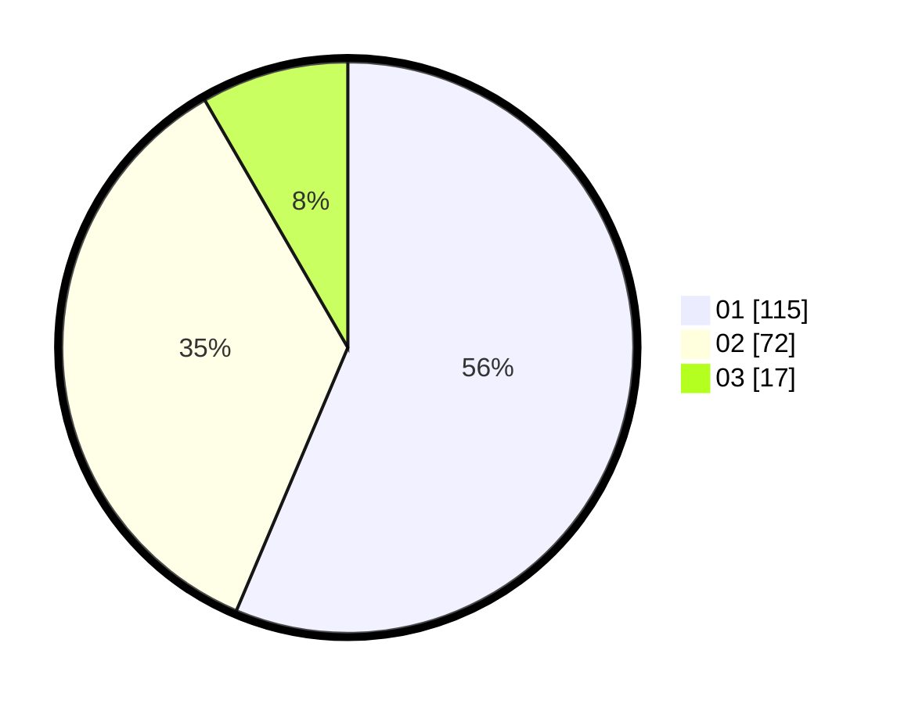

# Hasil

Hasil perolehan suara paslon dapat dilihat pada file paslon-01.txt, paslon-02.txt, dan paslon-03.txt.

Jika tidak ada, artinya data tersebut belum ada pada SIREKAP.

## Perolehan Suara

 * Paslon 01: **115**.
 * Paslon 02: **72**.
 * Paslon 03: **17**.

## Foto C Plano

https://sirekap-obj-formc.kpu.go.id/2eb5/pemilu/ppwp/31/73/02/10/03/3173021003083-20240215-231624--f9538853-78f7-420c-83a2-9940b4fdb15a.jpg

https://sirekap-obj-formc.kpu.go.id/2eb5/pemilu/ppwp/31/73/02/10/03/3173021003083-20240215-231644--98a5e58f-d329-46f1-8b43-912bb63c4793.jpg

https://sirekap-obj-formc.kpu.go.id/2eb5/pemilu/ppwp/31/73/02/10/03/3173021003083-20240215-231628--a4b13704-6f00-4af9-9e63-4bc88521d710.jpg

## DATA PEMILIH TETAP

Jumlah pemilih dalam DPT: **263**.
 * L: **137**.
 * P: **126**.

## DATA PENGGUNA HAK PILIH

Jumlah pengguna hak pilih dalam DPT: **200**.
 * L: **102**.
 * P: **98**.

Jumlah pengguna hak pilih dalam DPTb: **2**.
 * L: **2**.
 * P: **0**.

Jumlah pengguna hak pilih dalam DPK: **3**.
 * L: **2**.
 * P: **1**.

Jumlah pengguna hak pilih: **205**.
 * L: **106**.
 * P: **99**.

## JUMLAH SUARA SAH DAN TIDAK SAH

JUMLAH SELURUH SUARA SAH: **204**.

JUMLAH SUARA TIDAK SAH: **1**.

JUMLAH SELURUH SUARA SAH DAN SUARA TIDAK SAH: **205**.
