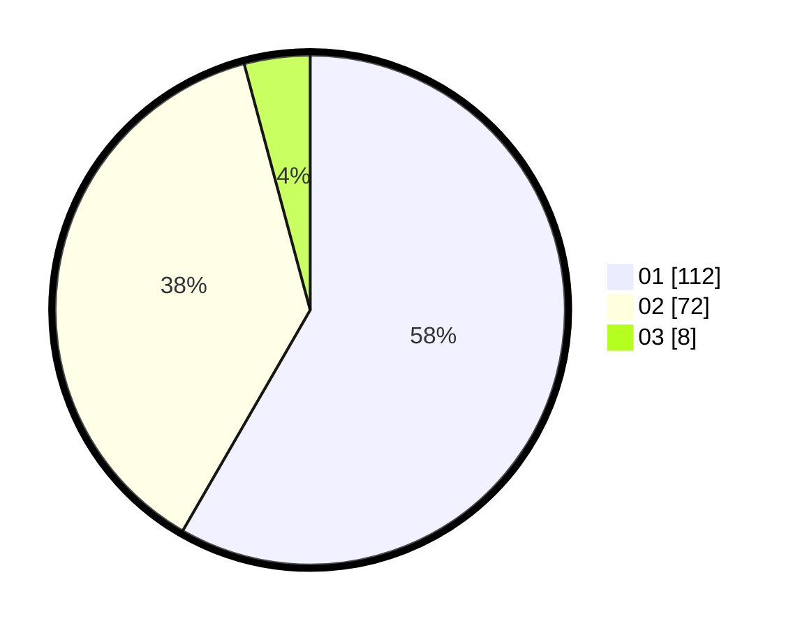

# Hasil

Hasil perolehan suara paslon dapat dilihat pada file paslon-01.txt, paslon-02.txt, dan paslon-03.txt.

Jika tidak ada, artinya data tersebut belum ada pada SIREKAP.

## Perolehan Suara

 * Paslon 01: **112**.
 * Paslon 02: **72**.
 * Paslon 03: **8**.

## Foto C Plano

https://sirekap-obj-formc.kpu.go.id/4330/pemilu/ppwp/31/73/02/10/03/3173021003091-20240216-132444--9695bfef-d3f3-4016-a006-64771aa612f7.jpg

https://sirekap-obj-formc.kpu.go.id/4330/pemilu/ppwp/31/73/02/10/03/3173021003091-20240216-132445--6d8c986c-f38f-40c8-ae19-f7badbe1b359.jpg

https://sirekap-obj-formc.kpu.go.id/4330/pemilu/ppwp/31/73/02/10/03/3173021003091-20240216-132444--e6deeef9-730d-4b35-9a40-138984605d49.jpg

## DATA PEMILIH TETAP

Jumlah pemilih dalam DPT: **245**.
 * L: **117**.
 * P: **128**.

## DATA PENGGUNA HAK PILIH

Jumlah pengguna hak pilih dalam DPT: **188**.
 * L: **94**.
 * P: **94**.

Jumlah pengguna hak pilih dalam DPTb: **5**.
 * L: **0**.
 * P: **5**.

Jumlah pengguna hak pilih dalam DPK: **1**.
 * L: **1**.
 * P: **0**.

Jumlah pengguna hak pilih: **194**.
 * L: **95**.
 * P: **99**.

## JUMLAH SUARA SAH DAN TIDAK SAH

JUMLAH SELURUH SUARA SAH: **192**.

JUMLAH SUARA TIDAK SAH: **2**.

JUMLAH SELURUH SUARA SAH DAN SUARA TIDAK SAH: **194**.
