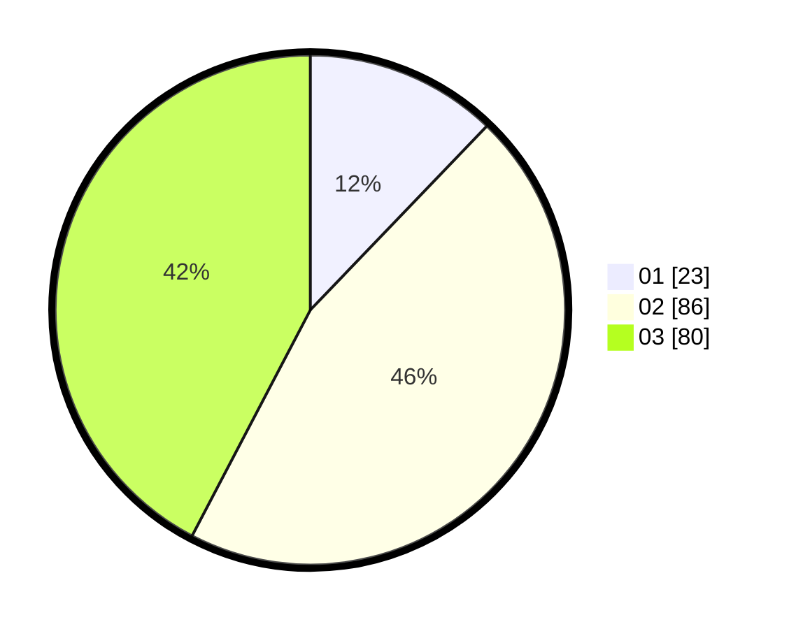

# Hasil

Hasil perolehan suara paslon dapat dilihat pada file paslon-01.txt, paslon-02.txt, dan paslon-03.txt.

Jika tidak ada, artinya data tersebut belum ada pada SIREKAP.

## Perolehan Suara

 * Paslon 01: **23**.
 * Paslon 02: **86**.
 * Paslon 03: **80**.

## Foto C Plano

https://sirekap-obj-formc.kpu.go.id/9682/pemilu/ppwp/31/73/02/10/03/3173021003096-20240216-122206--3b85c07b-f48f-4cee-a8a7-ac4339b8053a.jpg

https://sirekap-obj-formc.kpu.go.id/9682/pemilu/ppwp/31/73/02/10/03/3173021003096-20240216-122208--29d06f05-48a5-4c6a-9f8d-7ce84815125b.jpg

https://sirekap-obj-formc.kpu.go.id/9682/pemilu/ppwp/31/73/02/10/03/3173021003096-20240216-122207--af339ea9-127f-42de-9a30-ff9ef3f6589b.jpg

## DATA PEMILIH TETAP

Jumlah pemilih dalam DPT: **251**.
 * L: **117**.
 * P: **134**.

## DATA PENGGUNA HAK PILIH

Jumlah pengguna hak pilih dalam DPT: **179**.
 * L: **79**.
 * P: **100**.

Jumlah pengguna hak pilih dalam DPTb: **13**.
 * L: **5**.
 * P: **8**.

Jumlah pengguna hak pilih dalam DPK: **1**.
 * L: **0**.
 * P: **1**.

Jumlah pengguna hak pilih: **193**.
 * L: **84**.
 * P: **109**.

## JUMLAH SUARA SAH DAN TIDAK SAH

JUMLAH SELURUH SUARA SAH: **189**.

JUMLAH SUARA TIDAK SAH: **4**.

JUMLAH SELURUH SUARA SAH DAN SUARA TIDAK SAH: **193**.
