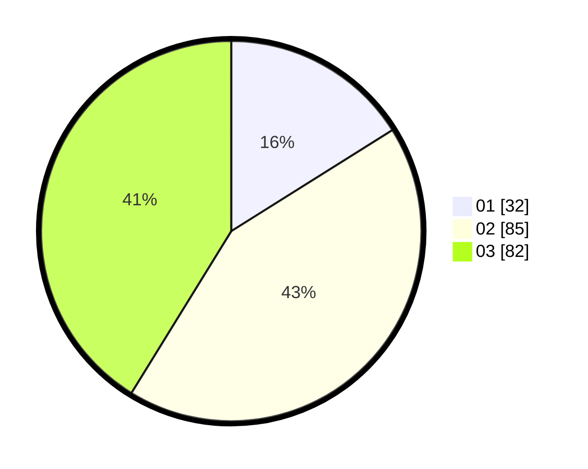

# Hasil

Hasil perolehan suara paslon dapat dilihat pada file paslon-01.txt, paslon-02.txt, dan paslon-03.txt.

Jika tidak ada, artinya data tersebut belum ada pada SIREKAP.

## Perolehan Suara

 * Paslon 01: **32**.
 * Paslon 02: **85**.
 * Paslon 03: **82**.

## Foto C Plano

https://sirekap-obj-formc.kpu.go.id/a924/pemilu/ppwp/31/73/02/10/03/3173021003098-20240216-142810--f34f304f-ec96-4caa-8a99-a43e13197fb6.jpg

https://sirekap-obj-formc.kpu.go.id/a924/pemilu/ppwp/31/73/02/10/03/3173021003098-20240216-142812--19abacf1-7d14-4454-b5ac-79494b385039.jpg

https://sirekap-obj-formc.kpu.go.id/a924/pemilu/ppwp/31/73/02/10/03/3173021003098-20240216-142811--1b38eb56-69cd-4094-8997-3a2299ed5271.jpg

## DATA PEMILIH TETAP

Jumlah pemilih dalam DPT: **264**.
 * L: **131**.
 * P: **133**.

## DATA PENGGUNA HAK PILIH

Jumlah pengguna hak pilih dalam DPT: **194**.
 * L: **99**.
 * P: **95**.

Jumlah pengguna hak pilih dalam DPTb: **9**.
 * L: **5**.
 * P: **4**.

Jumlah pengguna hak pilih dalam DPK: **3**.
 * L: **2**.
 * P: **1**.

Jumlah pengguna hak pilih: **206**.
 * L: **106**.
 * P: **100**.

## JUMLAH SUARA SAH DAN TIDAK SAH

JUMLAH SELURUH SUARA SAH: **199**.

JUMLAH SUARA TIDAK SAH: **7**.

JUMLAH SELURUH SUARA SAH DAN SUARA TIDAK SAH: **206**.
