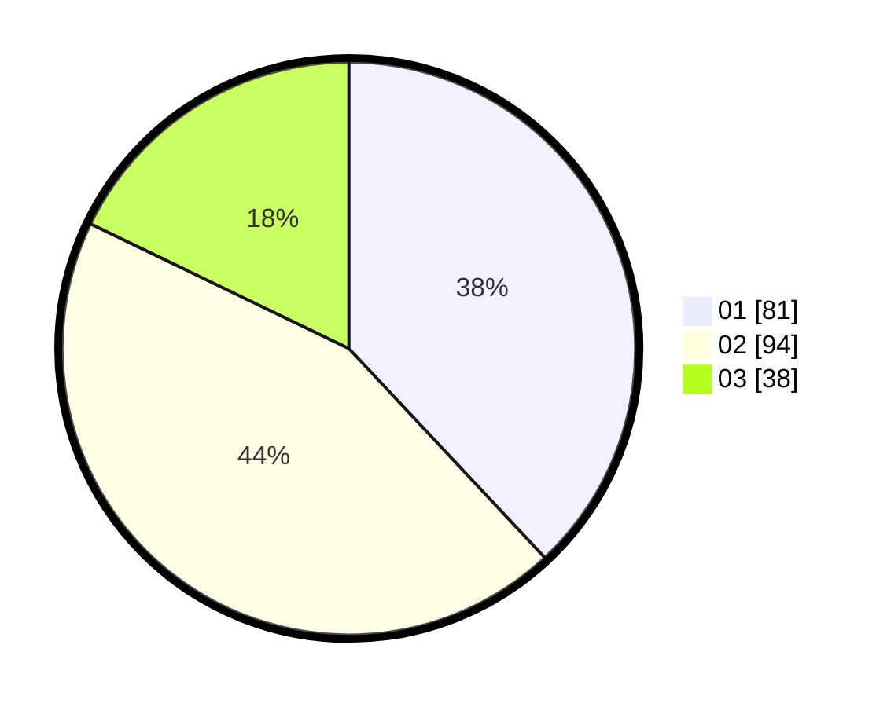

# Hasil

Hasil perolehan suara paslon dapat dilihat pada file paslon-01.txt, paslon-02.txt, dan paslon-03.txt.

Jika tidak ada, artinya data tersebut belum ada pada SIREKAP.

## Perolehan Suara

 * Paslon 01: **81**.
 * Paslon 02: **94**.
 * Paslon 03: **38**.

## Foto C Plano

https://sirekap-obj-formc.kpu.go.id/0d81/pemilu/ppwp/31/73/02/10/03/3173021003103-20240216-050828--0816bc87-6009-45fe-b261-12eeb633f0a9.jpg

https://sirekap-obj-formc.kpu.go.id/0d81/pemilu/ppwp/31/73/02/10/03/3173021003103-20240216-050830--9c50b537-800a-40e2-83cf-f100b07400ab.jpg

https://sirekap-obj-formc.kpu.go.id/0d81/pemilu/ppwp/31/73/02/10/03/3173021003103-20240216-050829--a8165a1e-7a34-41fb-b16f-12956c777abe.jpg

## DATA PEMILIH TETAP

Jumlah pemilih dalam DPT: **251**.
 * L: **134**.
 * P: **117**.

## DATA PENGGUNA HAK PILIH

Jumlah pengguna hak pilih dalam DPT: **206**.
 * L: **102**.
 * P: **104**.

Jumlah pengguna hak pilih dalam DPTb: **9**.
 * L: **4**.
 * P: **5**.

Jumlah pengguna hak pilih dalam DPK: **0**.
 * L: **0**.
 * P: **0**.

Jumlah pengguna hak pilih: **215**.
 * L: **106**.
 * P: **109**.

## JUMLAH SUARA SAH DAN TIDAK SAH

JUMLAH SELURUH SUARA SAH: **213**.

JUMLAH SUARA TIDAK SAH: **2**.

JUMLAH SELURUH SUARA SAH DAN SUARA TIDAK SAH: **215**.
