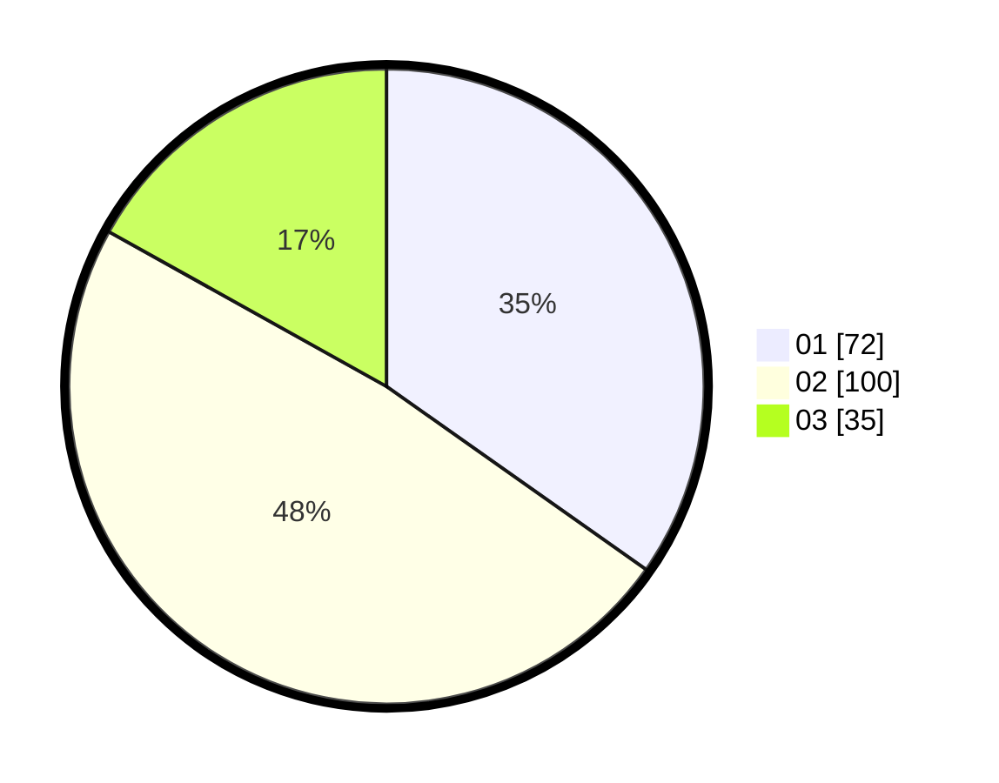

# Hasil

Hasil perolehan suara paslon dapat dilihat pada file paslon-01.txt, paslon-02.txt, dan paslon-03.txt.

Jika tidak ada, artinya data tersebut belum ada pada SIREKAP.

## Perolehan Suara

 * Paslon 01: **72**.
 * Paslon 02: **100**.
 * Paslon 03: **35**.

## Foto C Plano

https://sirekap-obj-formc.kpu.go.id/36b0/pemilu/ppwp/31/73/02/10/03/3173021003106-20240216-154911--3eddc402-3a0a-433d-a37f-ba3f9e3c04b1.jpg

https://sirekap-obj-formc.kpu.go.id/36b0/pemilu/ppwp/31/73/02/10/03/3173021003106-20240216-154913--9cd918ef-2a6d-4c2c-89a2-d99759e38edd.jpg

https://sirekap-obj-formc.kpu.go.id/36b0/pemilu/ppwp/31/73/02/10/03/3173021003106-20240216-154912--1f3eaac5-de49-42ba-ad51-275137054092.jpg

## DATA PEMILIH TETAP

Jumlah pemilih dalam DPT: **254**.
 * L: **124**.
 * P: **130**.

## DATA PENGGUNA HAK PILIH

Jumlah pengguna hak pilih dalam DPT: **200**.
 * L: **97**.
 * P: **103**.

Jumlah pengguna hak pilih dalam DPTb: **13**.
 * L: **9**.
 * P: **4**.

Jumlah pengguna hak pilih dalam DPK: **0**.
 * L: **0**.
 * P: **0**.

Jumlah pengguna hak pilih: **213**.
 * L: **106**.
 * P: **107**.

## JUMLAH SUARA SAH DAN TIDAK SAH

JUMLAH SELURUH SUARA SAH: **207**.

JUMLAH SUARA TIDAK SAH: **6**.

JUMLAH SELURUH SUARA SAH DAN SUARA TIDAK SAH: **213**.
