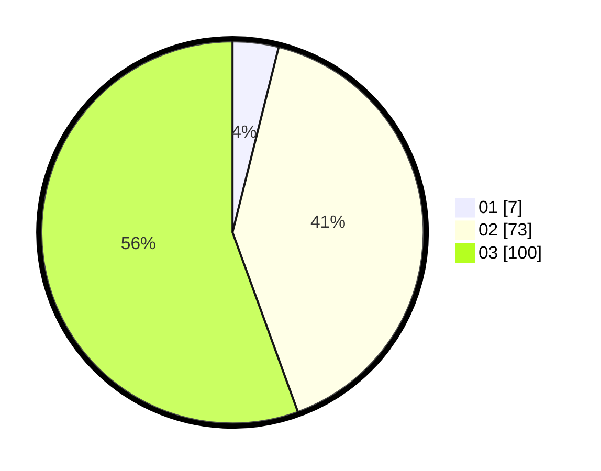

# Hasil

Hasil perolehan suara paslon dapat dilihat pada file paslon-01.txt, paslon-02.txt, dan paslon-03.txt.

Jika tidak ada, artinya data tersebut belum ada pada SIREKAP.

## Perolehan Suara

 * Paslon 01: **7**.
 * Paslon 02: **73**.
 * Paslon 03: **100**.

## Foto C Plano

https://sirekap-obj-formc.kpu.go.id/86bc/pemilu/ppwp/31/73/02/10/04/3173021004002-20240214-192658--e090070b-deda-4904-8abf-b3c12f10e2cc.jpg

https://sirekap-obj-formc.kpu.go.id/86bc/pemilu/ppwp/31/73/02/10/04/3173021004002-20240214-194917--6f9fdcad-3756-40ab-b8a5-78b9726bda95.jpg

https://sirekap-obj-formc.kpu.go.id/86bc/pemilu/ppwp/31/73/02/10/04/3173021004002-20240214-195041--11d951ef-68ec-4c59-b10a-99a2e36362df.jpg

## DATA PEMILIH TETAP

Jumlah pemilih dalam DPT: **394**.
 * L: **703**.
 * P: **403**.

## DATA PENGGUNA HAK PILIH

Jumlah pengguna hak pilih dalam DPT: **45**.
 * L: **374**.
 * P: **100**.

Jumlah pengguna hak pilih dalam DPTb: **432**.
 * L: **555**.
 * P: **353**.

Jumlah pengguna hak pilih dalam DPK: **333**.
 * L: **353**.
 * P: **933**.

Jumlah pengguna hak pilih: **191**.
 * L: **375**.
 * P: **774**.

## JUMLAH SUARA SAH DAN TIDAK SAH

JUMLAH SELURUH SUARA SAH: **180**.

JUMLAH SUARA TIDAK SAH: **1**.

JUMLAH SELURUH SUARA SAH DAN SUARA TIDAK SAH: **181**.
