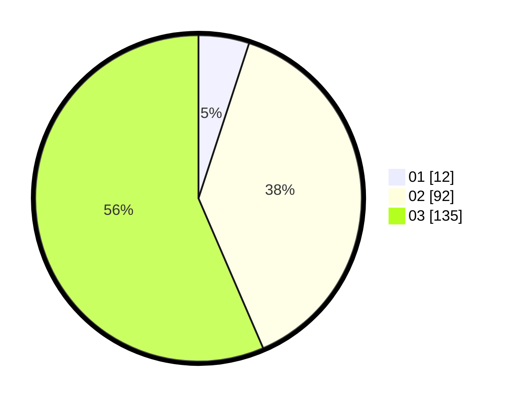

# Hasil

Hasil perolehan suara paslon dapat dilihat pada file paslon-01.txt, paslon-02.txt, dan paslon-03.txt.

Jika tidak ada, artinya data tersebut belum ada pada SIREKAP.

## Perolehan Suara

 * Paslon 01: **12**.
 * Paslon 02: **92**.
 * Paslon 03: **135**.

## Foto C Plano

https://sirekap-obj-formc.kpu.go.id/7f4a/pemilu/ppwp/31/73/02/10/04/3173021004004-20240216-021457--188007b1-3cc8-400d-9d76-1999c3585d0a.jpg

https://sirekap-obj-formc.kpu.go.id/7f4a/pemilu/ppwp/31/73/02/10/04/3173021004004-20240216-021459--bc230319-aa48-4cfa-bfd4-1b45e9caee32.jpg

https://sirekap-obj-formc.kpu.go.id/7f4a/pemilu/ppwp/31/73/02/10/04/3173021004004-20240216-021458--90f28f47-7c06-4a74-b367-38a30db5d1d9.jpg

## DATA PEMILIH TETAP

Jumlah pemilih dalam DPT: **282**.
 * L: **127**.
 * P: **155**.

## DATA PENGGUNA HAK PILIH

Jumlah pengguna hak pilih dalam DPT: **224**.
 * L: **101**.
 * P: **123**.

Jumlah pengguna hak pilih dalam DPTb: **13**.
 * L: **5**.
 * P: **8**.

Jumlah pengguna hak pilih dalam DPK: **6**.
 * L: **3**.
 * P: **3**.

Jumlah pengguna hak pilih: **243**.
 * L: **109**.
 * P: **134**.

## JUMLAH SUARA SAH DAN TIDAK SAH

JUMLAH SELURUH SUARA SAH: **239**.

JUMLAH SUARA TIDAK SAH: **4**.

JUMLAH SELURUH SUARA SAH DAN SUARA TIDAK SAH: **243**.
