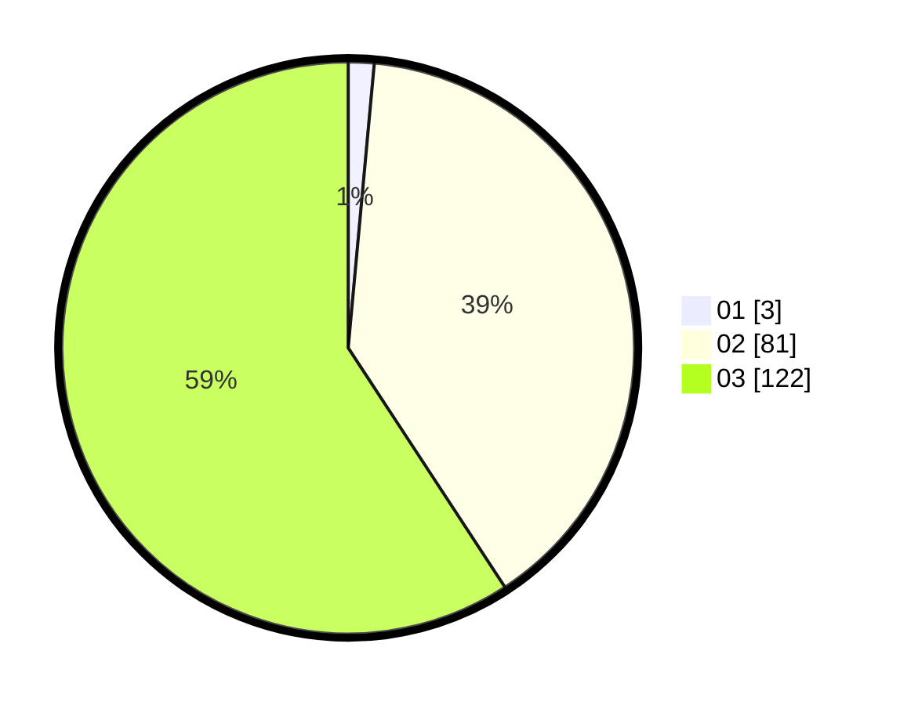

# Hasil

Hasil perolehan suara paslon dapat dilihat pada file paslon-01.txt, paslon-02.txt, dan paslon-03.txt.

Jika tidak ada, artinya data tersebut belum ada pada SIREKAP.

## Perolehan Suara

 * Paslon 01: **3**.
 * Paslon 02: **81**.
 * Paslon 03: **122**.

## Foto C Plano

https://sirekap-obj-formc.kpu.go.id/12e7/pemilu/ppwp/31/73/02/10/04/3173021004006-20240214-222314--57903d8e-db41-40da-96d9-5df68f3ec599.jpg

https://sirekap-obj-formc.kpu.go.id/12e7/pemilu/ppwp/31/73/02/10/04/3173021004006-20240214-234616--f63fa598-14aa-43df-906b-0be698a83781.jpg

https://sirekap-obj-formc.kpu.go.id/12e7/pemilu/ppwp/31/73/02/10/04/3173021004006-20240214-235052--90242224-4b02-45aa-adc4-d74b07704ff6.jpg
