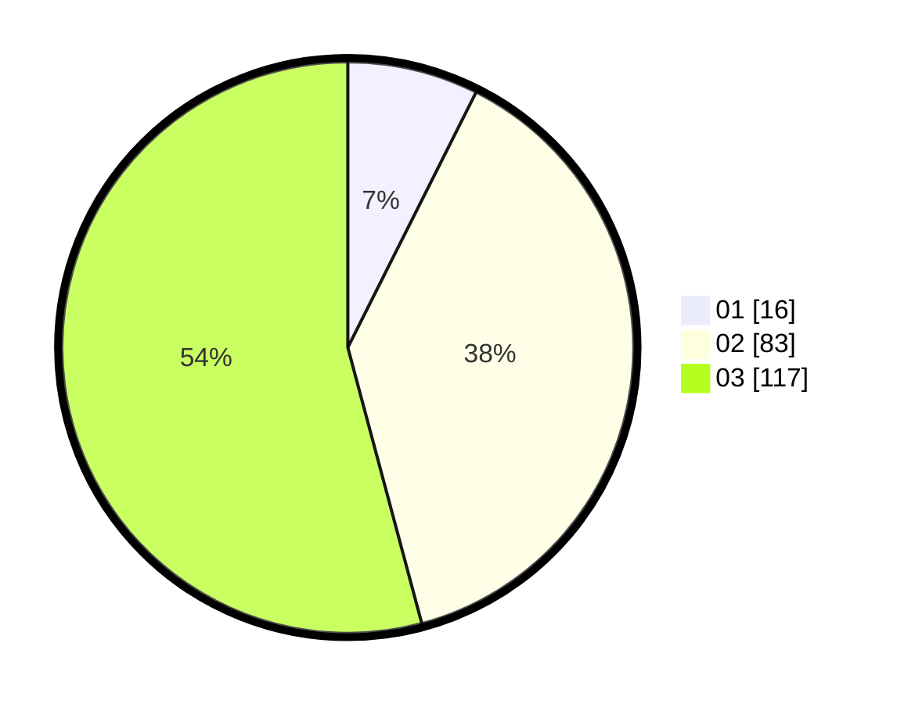

# Hasil

Hasil perolehan suara paslon dapat dilihat pada file paslon-01.txt, paslon-02.txt, dan paslon-03.txt.

Jika tidak ada, artinya data tersebut belum ada pada SIREKAP.

## Perolehan Suara

 * Paslon 01: **16**.
 * Paslon 02: **83**.
 * Paslon 03: **117**.

## Foto C Plano

https://sirekap-obj-formc.kpu.go.id/0dc8/pemilu/ppwp/31/73/02/10/04/3173021004007-20240216-142638--1389e7a8-1049-4e04-946f-61f290128f0a.jpg

https://sirekap-obj-formc.kpu.go.id/0dc8/pemilu/ppwp/31/73/02/10/04/3173021004007-20240216-142640--6f5e82da-5ee6-489b-ad01-60dc765f0349.jpg

https://sirekap-obj-formc.kpu.go.id/0dc8/pemilu/ppwp/31/73/02/10/04/3173021004007-20240216-142639--4ddbd145-bdb8-4c72-bc2c-a0cbe7d166d0.jpg

## DATA PEMILIH TETAP

Jumlah pemilih dalam DPT: **293**.
 * L: **140**.
 * P: **153**.

## DATA PENGGUNA HAK PILIH

Jumlah pengguna hak pilih dalam DPT: **222**.
 * L: **108**.
 * P: **114**.

Jumlah pengguna hak pilih dalam DPTb: **5**.
 * L: **1**.
 * P: **4**.

Jumlah pengguna hak pilih dalam DPK: **1**.
 * L: **1**.
 * P: **0**.

Jumlah pengguna hak pilih: **228**.
 * L: **110**.
 * P: **118**.

## JUMLAH SUARA SAH DAN TIDAK SAH

JUMLAH SELURUH SUARA SAH: **216**.

JUMLAH SUARA TIDAK SAH: **12**.

JUMLAH SELURUH SUARA SAH DAN SUARA TIDAK SAH: **228**.
