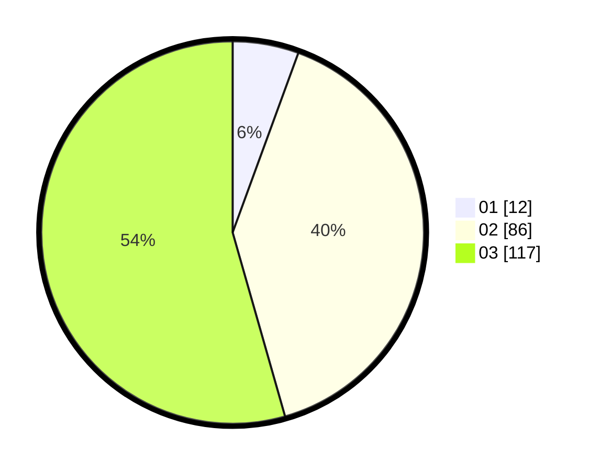

# Hasil

Hasil perolehan suara paslon dapat dilihat pada file paslon-01.txt, paslon-02.txt, dan paslon-03.txt.

Jika tidak ada, artinya data tersebut belum ada pada SIREKAP.

## Perolehan Suara

 * Paslon 01: **12**.
 * Paslon 02: **86**.
 * Paslon 03: **117**.

## Foto C Plano

https://sirekap-obj-formc.kpu.go.id/cbfb/pemilu/ppwp/31/73/02/10/04/3173021004009-20240214-194540--7da6ab6b-2756-4867-a2d4-b078cde89771.jpg

https://sirekap-obj-formc.kpu.go.id/cbfb/pemilu/ppwp/31/73/02/10/04/3173021004009-20240214-194543--0d4ba088-7f67-4ddf-99f5-45b8c76b4be0.jpg

https://sirekap-obj-formc.kpu.go.id/cbfb/pemilu/ppwp/31/73/02/10/04/3173021004009-20240214-194546--b3ac6d08-5e26-4a16-ae61-926dfd2c92f9.jpg

## DATA PEMILIH TETAP

Jumlah pemilih dalam DPT: **280**.
 * L: **132**.
 * P: **148**.

## DATA PENGGUNA HAK PILIH

Jumlah pengguna hak pilih dalam DPT: **264**.
 * L: **125**.
 * P: **139**.

Jumlah pengguna hak pilih dalam DPTb: **12**.
 * L: **6**.
 * P: **6**.

Jumlah pengguna hak pilih dalam DPK: **4**.
 * L: **1**.
 * P: **3**.

Jumlah pengguna hak pilih: **280**.
 * L: **132**.
 * P: **148**.

## JUMLAH SUARA SAH DAN TIDAK SAH

JUMLAH SELURUH SUARA SAH: **215**.

JUMLAH SUARA TIDAK SAH: **2**.

JUMLAH SELURUH SUARA SAH DAN SUARA TIDAK SAH: **217**.
