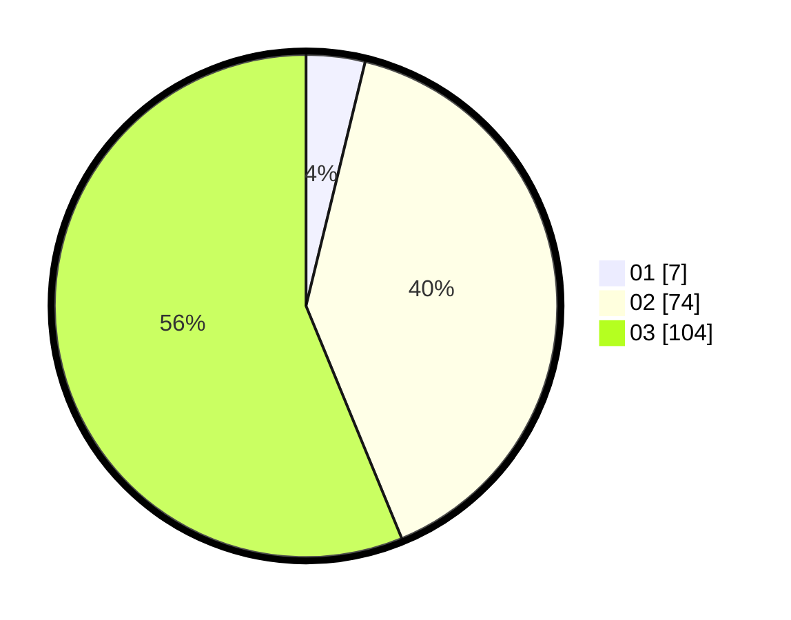

# Hasil

Hasil perolehan suara paslon dapat dilihat pada file paslon-01.txt, paslon-02.txt, dan paslon-03.txt.

Jika tidak ada, artinya data tersebut belum ada pada SIREKAP.

## Perolehan Suara

 * Paslon 01: **7**.
 * Paslon 02: **74**.
 * Paslon 03: **104**.

## Foto C Plano

https://sirekap-obj-formc.kpu.go.id/c194/pemilu/ppwp/31/73/02/10/04/3173021004010-20240214-211717--1774ad4d-faf8-46b6-83ef-c34a42d978ab.jpg

https://sirekap-obj-formc.kpu.go.id/c194/pemilu/ppwp/31/73/02/10/04/3173021004010-20240214-211803--cbe00beb-a527-4af3-af00-05d69d340059.jpg

https://sirekap-obj-formc.kpu.go.id/c194/pemilu/ppwp/31/73/02/10/04/3173021004010-20240214-211839--4e934a42-552d-4f41-bb18-1c35fc811289.jpg
