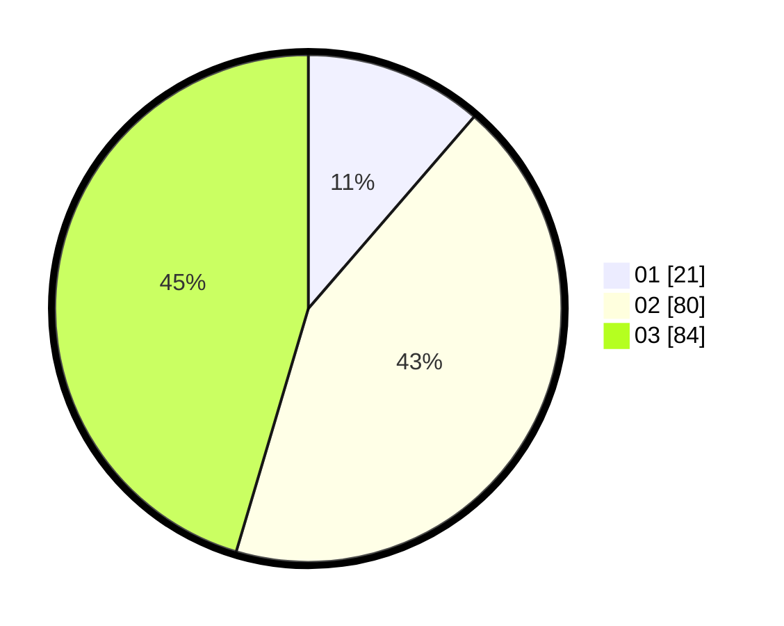

# Hasil

Hasil perolehan suara paslon dapat dilihat pada file paslon-01.txt, paslon-02.txt, dan paslon-03.txt.

Jika tidak ada, artinya data tersebut belum ada pada SIREKAP.

## Perolehan Suara

 * Paslon 01: **21**.
 * Paslon 02: **80**.
 * Paslon 03: **84**.

## Foto C Plano

https://sirekap-obj-formc.kpu.go.id/4bdf/pemilu/ppwp/31/73/02/10/04/3173021004011-20240214-212137--f93222c3-2097-48a4-b6a0-5bef7b4cfc81.jpg

https://sirekap-obj-formc.kpu.go.id/4bdf/pemilu/ppwp/31/73/02/10/04/3173021004011-20240214-195445--53d5c4f6-3cc3-486c-93af-96575a79a5a3.jpg

https://sirekap-obj-formc.kpu.go.id/4bdf/pemilu/ppwp/31/73/02/10/04/3173021004011-20240214-205913--c875de7d-d2eb-4c9d-83a3-512348397d8c.jpg
