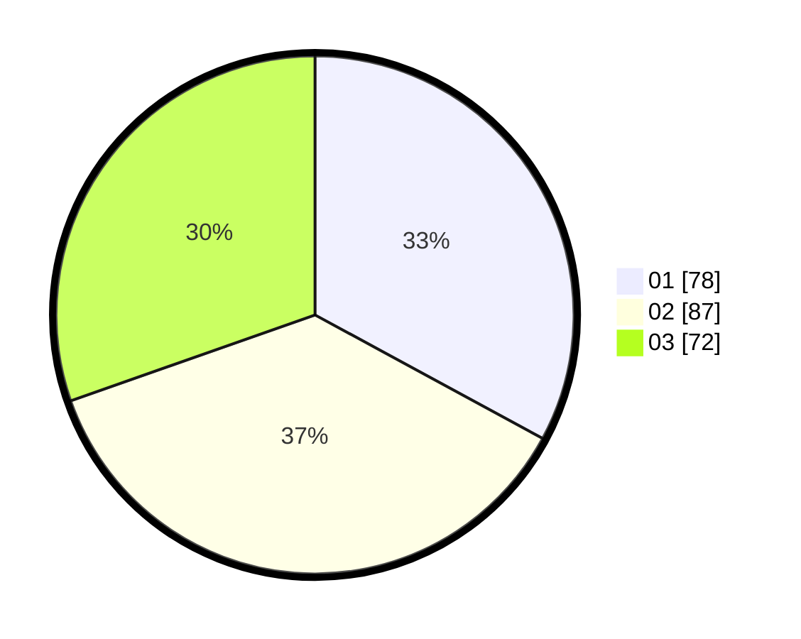

# Hasil

Hasil perolehan suara paslon dapat dilihat pada file paslon-01.txt, paslon-02.txt, dan paslon-03.txt.

Jika tidak ada, artinya data tersebut belum ada pada SIREKAP.

## Perolehan Suara

 * Paslon 01: **78**.
 * Paslon 02: **87**.
 * Paslon 03: **72**.

## Foto C Plano

https://sirekap-obj-formc.kpu.go.id/54f0/pemilu/ppwp/31/73/02/10/04/3173021004017-20240214-223005--bf9f4c2e-f4e7-4b6a-a061-fe6f35717c20.jpg

https://sirekap-obj-formc.kpu.go.id/54f0/pemilu/ppwp/31/73/02/10/04/3173021004017-20240214-223116--ac475b38-cc77-4d4e-b409-8a75ad15dfa1.jpg

https://sirekap-obj-formc.kpu.go.id/54f0/pemilu/ppwp/31/73/02/10/04/3173021004017-20240214-223248--5f962c72-2b21-4785-8829-f83024f94af7.jpg
