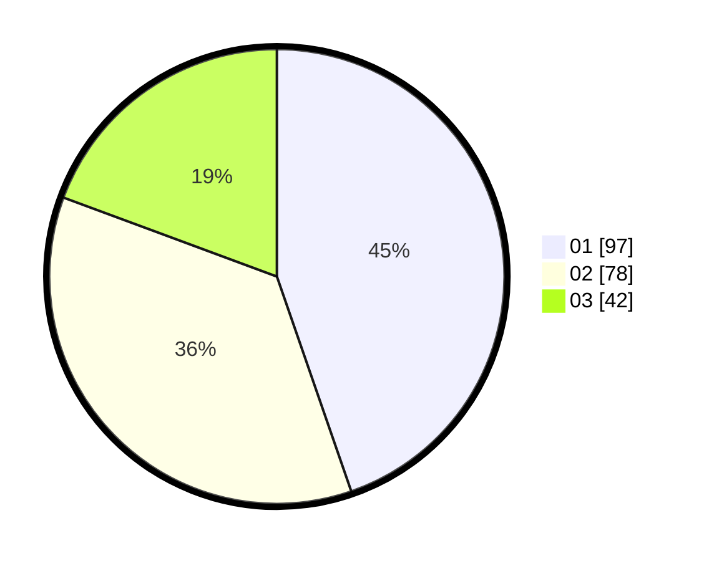

# Hasil

Hasil perolehan suara paslon dapat dilihat pada file paslon-01.txt, paslon-02.txt, dan paslon-03.txt.

Jika tidak ada, artinya data tersebut belum ada pada SIREKAP.

## Perolehan Suara

 * Paslon 01: **97**.
 * Paslon 02: **78**.
 * Paslon 03: **42**.

## Foto C Plano

https://sirekap-obj-formc.kpu.go.id/c5f3/pemilu/ppwp/31/73/02/10/04/3173021004019-20240216-114139--33d03e81-ecfa-459e-80ad-ca300e1aeeec.jpg

https://sirekap-obj-formc.kpu.go.id/c5f3/pemilu/ppwp/31/73/02/10/04/3173021004019-20240214-211028--b5de7bb9-dcc3-4e04-a781-c62fcbfff157.jpg

https://sirekap-obj-formc.kpu.go.id/c5f3/pemilu/ppwp/31/73/02/10/04/3173021004019-20240214-211313--33d818c9-3524-490f-ac3a-9ec320e612bf.jpg
