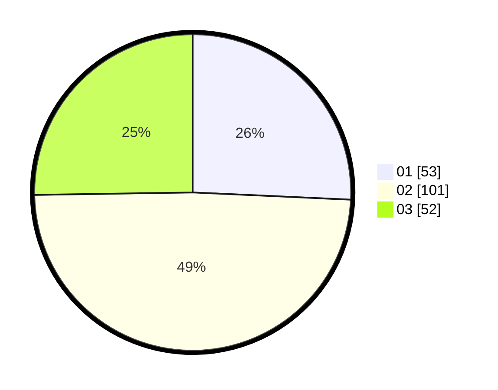

# Hasil

Hasil perolehan suara paslon dapat dilihat pada file paslon-01.txt, paslon-02.txt, dan paslon-03.txt.

Jika tidak ada, artinya data tersebut belum ada pada SIREKAP.

## Perolehan Suara

 * Paslon 01: **53**.
 * Paslon 02: **101**.
 * Paslon 03: **52**.

## Foto C Plano

https://sirekap-obj-formc.kpu.go.id/ac70/pemilu/ppwp/31/73/02/10/04/3173021004023-20240216-015132--91d8574f-6d08-45e0-a1ed-bf975c7b071e.jpg

https://sirekap-obj-formc.kpu.go.id/ac70/pemilu/ppwp/31/73/02/10/04/3173021004023-20240216-015148--614d4e84-9a0e-4cc6-99a3-4d58ff5543e1.jpg

https://sirekap-obj-formc.kpu.go.id/ac70/pemilu/ppwp/31/73/02/10/04/3173021004023-20240216-015141--db03f8af-4b05-4856-b693-f2ff60436f45.jpg

## DATA PEMILIH TETAP

Jumlah pemilih dalam DPT: **283**.
 * L: **139**.
 * P: **144**.

## DATA PENGGUNA HAK PILIH

Jumlah pengguna hak pilih dalam DPT: **201**.
 * L: **98**.
 * P: **103**.

Jumlah pengguna hak pilih dalam DPTb: **7**.
 * L: **6**.
 * P: **1**.

Jumlah pengguna hak pilih dalam DPK: **2**.
 * L: **2**.
 * P: **0**.

Jumlah pengguna hak pilih: **210**.
 * L: **106**.
 * P: **104**.

## JUMLAH SUARA SAH DAN TIDAK SAH

JUMLAH SELURUH SUARA SAH: **206**.

JUMLAH SUARA TIDAK SAH: **4**.

JUMLAH SELURUH SUARA SAH DAN SUARA TIDAK SAH: **210**.
