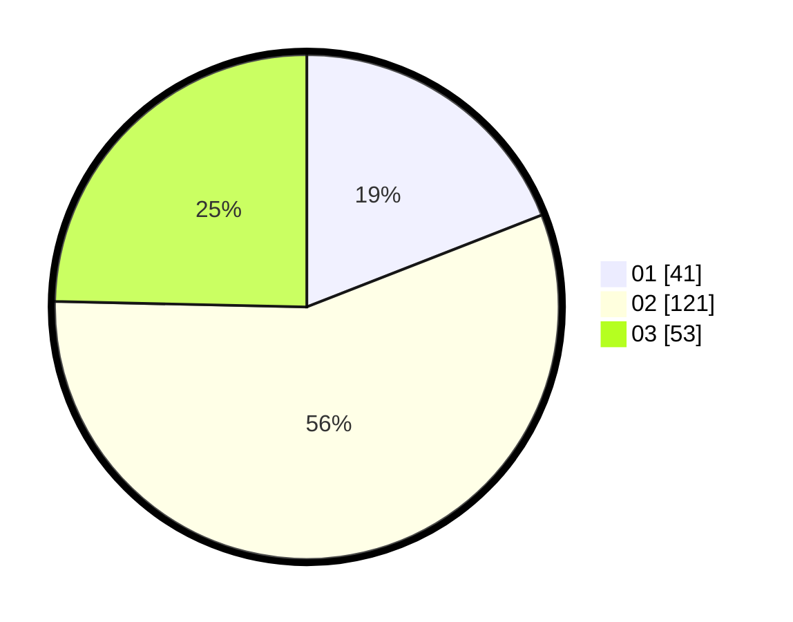

# Hasil

Hasil perolehan suara paslon dapat dilihat pada file paslon-01.txt, paslon-02.txt, dan paslon-03.txt.

Jika tidak ada, artinya data tersebut belum ada pada SIREKAP.

## Perolehan Suara

 * Paslon 01: **41**.
 * Paslon 02: **121**.
 * Paslon 03: **53**.

## Foto C Plano

https://sirekap-obj-formc.kpu.go.id/292c/pemilu/ppwp/31/73/02/10/04/3173021004024-20240214-231124--43c294e8-24e7-41ac-a52b-a1db84ed0fd7.jpg

https://sirekap-obj-formc.kpu.go.id/292c/pemilu/ppwp/31/73/02/10/04/3173021004024-20240214-231226--d0fa23b7-076c-48d4-880d-b9abd53aedd2.jpg

https://sirekap-obj-formc.kpu.go.id/292c/pemilu/ppwp/31/73/02/10/04/3173021004024-20240214-231306--54aeb68c-f256-46cc-8cb7-8c08811dd5cd.jpg
