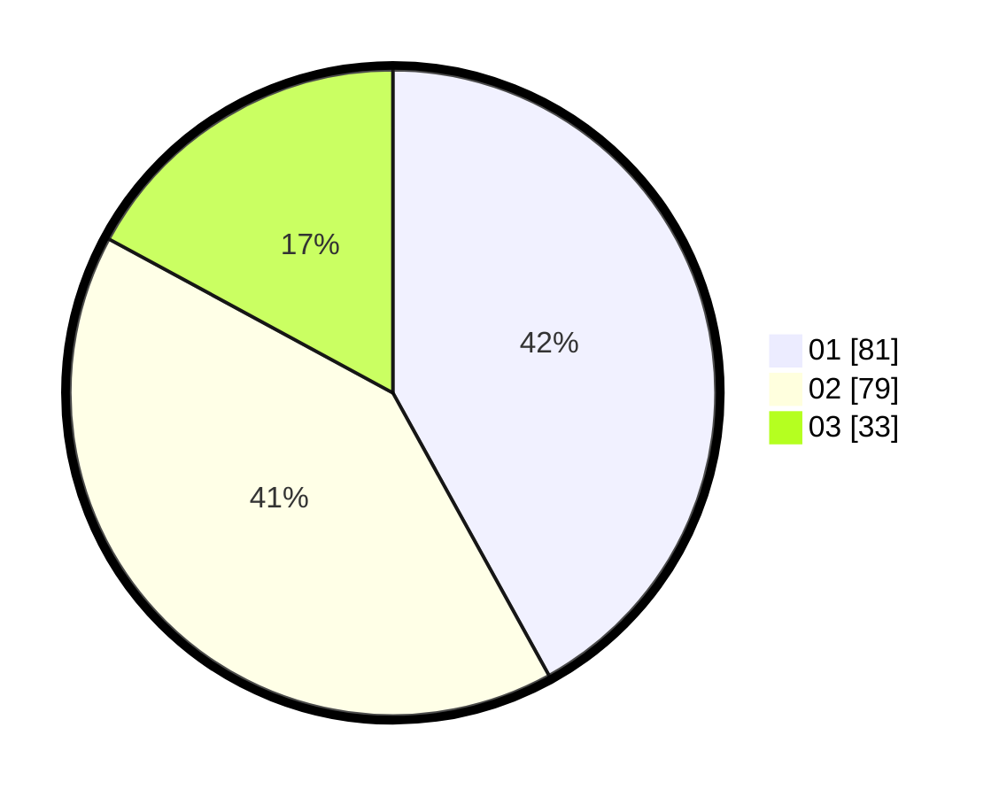

# Hasil

Hasil perolehan suara paslon dapat dilihat pada file paslon-01.txt, paslon-02.txt, dan paslon-03.txt.

Jika tidak ada, artinya data tersebut belum ada pada SIREKAP.

## Perolehan Suara

 * Paslon 01: **81**.
 * Paslon 02: **79**.
 * Paslon 03: **33**.

## Foto C Plano

https://sirekap-obj-formc.kpu.go.id/ee45/pemilu/ppwp/31/73/02/10/04/3173021004025-20240214-193401--6393d407-e8c2-4c42-a383-a200ba05821a.jpg

https://sirekap-obj-formc.kpu.go.id/ee45/pemilu/ppwp/31/73/02/10/04/3173021004025-20240214-193410--fecc8737-92a6-45cf-b458-7530042584da.jpg

https://sirekap-obj-formc.kpu.go.id/ee45/pemilu/ppwp/31/73/02/10/04/3173021004025-20240214-193426--a3fef743-67ac-4085-ac2b-ffd3f6a46f81.jpg

## DATA PEMILIH TETAP

Jumlah pemilih dalam DPT: **266**.
 * L: **130**.
 * P: **136**.

## DATA PENGGUNA HAK PILIH

Jumlah pengguna hak pilih dalam DPT: **188**.
 * L: **88**.
 * P: **100**.

Jumlah pengguna hak pilih dalam DPTb: **4**.
 * L: **1**.
 * P: **3**.

Jumlah pengguna hak pilih dalam DPK: **3**.
 * L: **1**.
 * P: **2**.

Jumlah pengguna hak pilih: **195**.
 * L: **90**.
 * P: **105**.

## JUMLAH SUARA SAH DAN TIDAK SAH

JUMLAH SELURUH SUARA SAH: **193**.

JUMLAH SUARA TIDAK SAH: **2**.

JUMLAH SELURUH SUARA SAH DAN SUARA TIDAK SAH: **195**.
