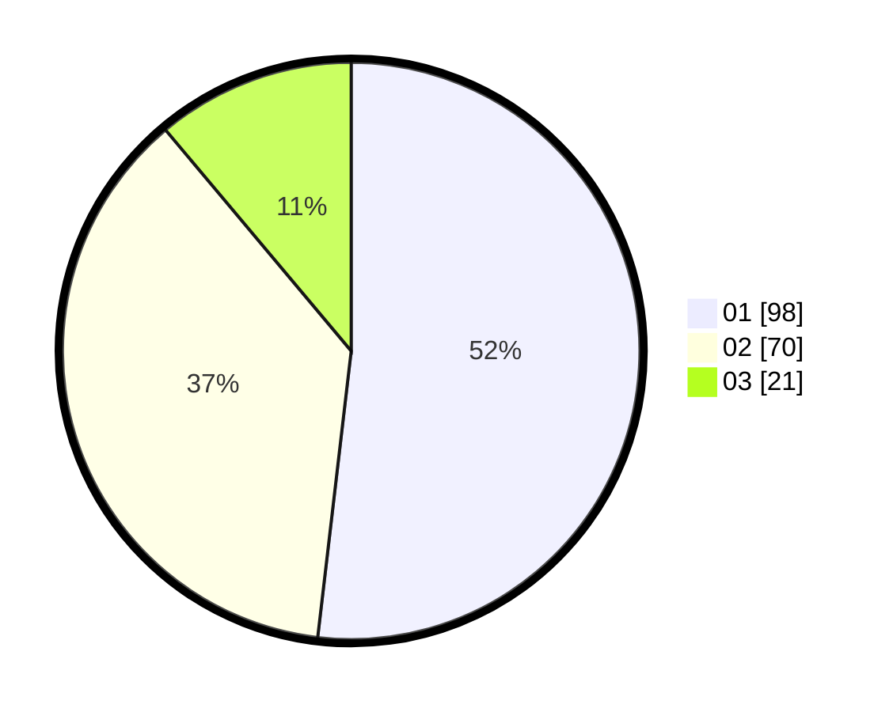

# Hasil

Hasil perolehan suara paslon dapat dilihat pada file paslon-01.txt, paslon-02.txt, dan paslon-03.txt.

Jika tidak ada, artinya data tersebut belum ada pada SIREKAP.

## Perolehan Suara

 * Paslon 01: **98**.
 * Paslon 02: **70**.
 * Paslon 03: **21**.

## Foto C Plano

https://sirekap-obj-formc.kpu.go.id/4f55/pemilu/ppwp/31/73/02/10/04/3173021004026-20240215-205049--e65e627e-381e-4417-86f0-356819bdd00d.jpg

https://sirekap-obj-formc.kpu.go.id/4f55/pemilu/ppwp/31/73/02/10/04/3173021004026-20240215-205706--9e0fd9a8-59d5-44c6-8eb6-452608233478.jpg

https://sirekap-obj-formc.kpu.go.id/4f55/pemilu/ppwp/31/73/02/10/04/3173021004026-20240215-201357--665dd9a8-9a4b-4b18-bf58-45386fd0ea2d.jpg
