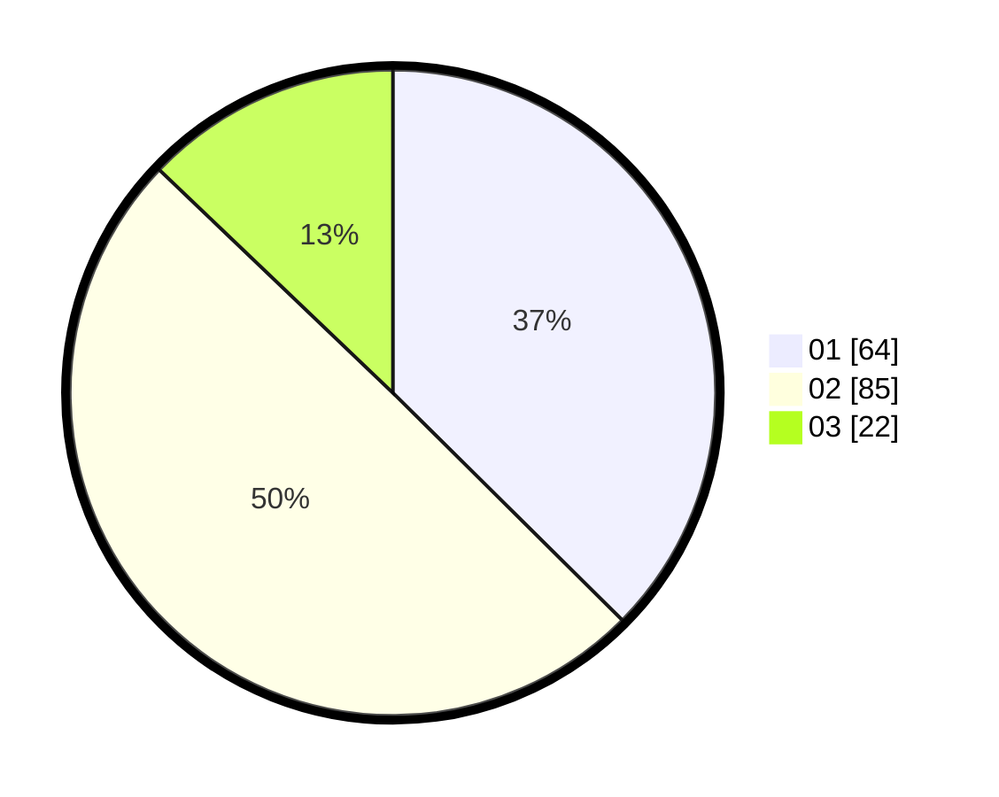

# Hasil

Hasil perolehan suara paslon dapat dilihat pada file paslon-01.txt, paslon-02.txt, dan paslon-03.txt.

Jika tidak ada, artinya data tersebut belum ada pada SIREKAP.

## Perolehan Suara

 * Paslon 01: **64**.
 * Paslon 02: **85**.
 * Paslon 03: **22**.

## Foto C Plano

https://sirekap-obj-formc.kpu.go.id/f4aa/pemilu/ppwp/31/73/02/10/04/3173021004031-20240215-021548--4d9165df-7e0a-4ea4-bb1e-91b40463857a.jpg

https://sirekap-obj-formc.kpu.go.id/f4aa/pemilu/ppwp/31/73/02/10/04/3173021004031-20240215-020914--c1c69515-46b7-4ba8-8a87-9b25cb55cea4.jpg

https://sirekap-obj-formc.kpu.go.id/f4aa/pemilu/ppwp/31/73/02/10/04/3173021004031-20240215-021030--48a2cf7d-7509-440a-82be-6fa00999bc7e.jpg
