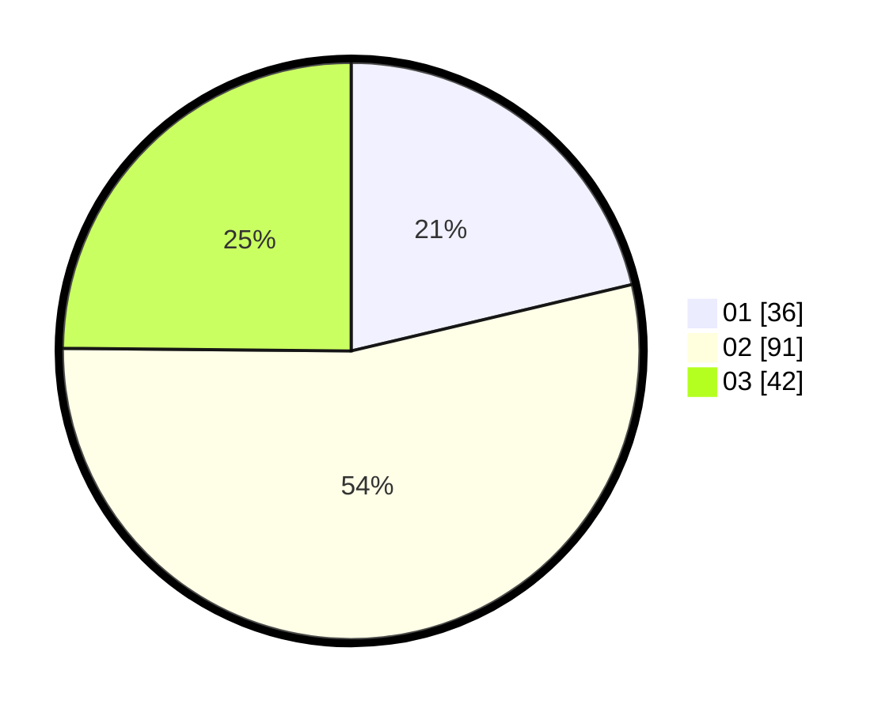

# Hasil

Hasil perolehan suara paslon dapat dilihat pada file paslon-01.txt, paslon-02.txt, dan paslon-03.txt.

Jika tidak ada, artinya data tersebut belum ada pada SIREKAP.

## Perolehan Suara

 * Paslon 01: **36**.
 * Paslon 02: **91**.
 * Paslon 03: **42**.

## Foto C Plano

https://sirekap-obj-formc.kpu.go.id/4edd/pemilu/ppwp/31/73/02/10/04/3173021004032-20240215-031005--09a912ef-65cc-462e-9eb8-fdcaecd117cd.jpg

https://sirekap-obj-formc.kpu.go.id/4edd/pemilu/ppwp/31/73/02/10/04/3173021004032-20240215-031408--e9251c06-4ea1-4d84-99d0-c01e394c9132.jpg

https://sirekap-obj-formc.kpu.go.id/4edd/pemilu/ppwp/31/73/02/10/04/3173021004032-20240215-033037--f87d5915-38ca-444f-8667-203cd5d36c74.jpg
