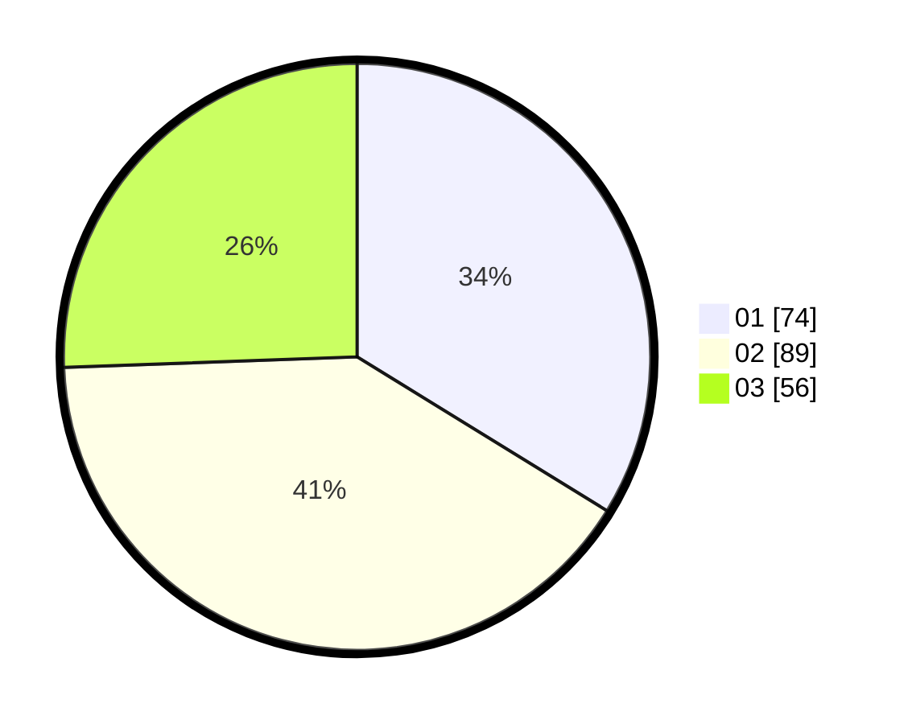

# Hasil

Hasil perolehan suara paslon dapat dilihat pada file paslon-01.txt, paslon-02.txt, dan paslon-03.txt.

Jika tidak ada, artinya data tersebut belum ada pada SIREKAP.

## Perolehan Suara

 * Paslon 01: **74**.
 * Paslon 02: **89**.
 * Paslon 03: **56**.

## Foto C Plano

https://sirekap-obj-formc.kpu.go.id/2118/pemilu/ppwp/31/73/02/10/04/3173021004033-20240215-041029--cb693b39-779b-4d0a-83c0-5aae20887e0b.jpg

https://sirekap-obj-formc.kpu.go.id/2118/pemilu/ppwp/31/73/02/10/04/3173021004033-20240215-025546--3cefe411-1dbc-4e79-926a-4bd8aad7cffa.jpg

https://sirekap-obj-formc.kpu.go.id/2118/pemilu/ppwp/31/73/02/10/04/3173021004033-20240215-041138--b3912771-c487-4a5d-a00e-402c79bf3519.jpg
