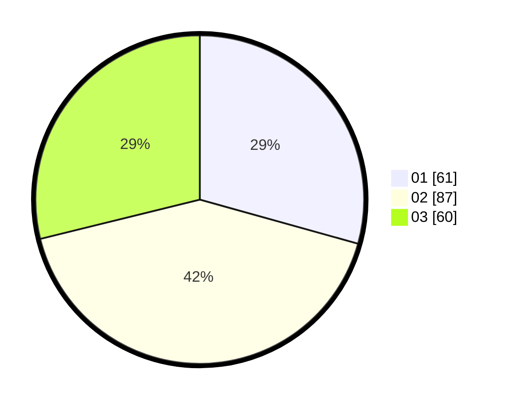

# Hasil

Hasil perolehan suara paslon dapat dilihat pada file paslon-01.txt, paslon-02.txt, dan paslon-03.txt.

Jika tidak ada, artinya data tersebut belum ada pada SIREKAP.

## Perolehan Suara

 * Paslon 01: **61**.
 * Paslon 02: **87**.
 * Paslon 03: **60**.

## Foto C Plano

https://sirekap-obj-formc.kpu.go.id/b650/pemilu/ppwp/31/73/02/10/04/3173021004034-20240216-222522--b2cab778-49e9-4cb5-b756-604285c738b6.jpg

https://sirekap-obj-formc.kpu.go.id/b650/pemilu/ppwp/31/73/02/10/04/3173021004034-20240216-222601--6919d9e3-41e9-464e-b715-7987ca326bb8.jpg

https://sirekap-obj-formc.kpu.go.id/b650/pemilu/ppwp/31/73/02/10/04/3173021004034-20240216-221742--6f5e0589-e733-475a-ab30-b1097ff51eb6.jpg
