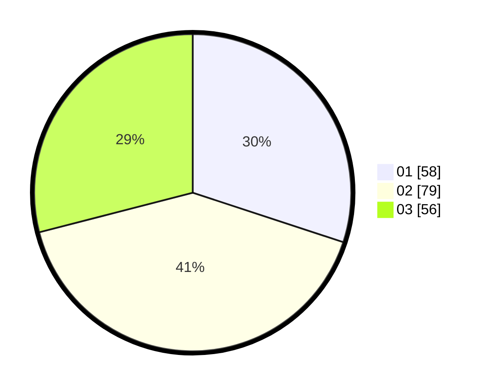

# Hasil

Hasil perolehan suara paslon dapat dilihat pada file paslon-01.txt, paslon-02.txt, dan paslon-03.txt.

Jika tidak ada, artinya data tersebut belum ada pada SIREKAP.

## Perolehan Suara

 * Paslon 01: **58**.
 * Paslon 02: **79**.
 * Paslon 03: **56**.

## Foto C Plano

https://sirekap-obj-formc.kpu.go.id/571f/pemilu/ppwp/31/73/02/10/04/3173021004035-20240215-025731--beb227ed-d7b9-4eed-9814-4d98cca06755.jpg

https://sirekap-obj-formc.kpu.go.id/571f/pemilu/ppwp/31/73/02/10/04/3173021004035-20240215-025744--2597a215-84bb-460f-9bb5-8e5b40e0a276.jpg

https://sirekap-obj-formc.kpu.go.id/571f/pemilu/ppwp/31/73/02/10/04/3173021004035-20240215-025828--a2c9a1dc-42a6-4c34-b118-108639f4f967.jpg

## DATA PEMILIH TETAP

Jumlah pemilih dalam DPT: **275**.
 * L: **134**.
 * P: **141**.

## DATA PENGGUNA HAK PILIH

Jumlah pengguna hak pilih dalam DPT: **189**.
 * L: **88**.
 * P: **101**.

Jumlah pengguna hak pilih dalam DPTb: **7**.
 * L: **3**.
 * P: **4**.

Jumlah pengguna hak pilih dalam DPK: **0**.
 * L: **0**.
 * P: **0**.

Jumlah pengguna hak pilih: **196**.
 * L: **91**.
 * P: **105**.

## JUMLAH SUARA SAH DAN TIDAK SAH

JUMLAH SELURUH SUARA SAH: **193**.

JUMLAH SUARA TIDAK SAH: **3**.

JUMLAH SELURUH SUARA SAH DAN SUARA TIDAK SAH: **196**.
