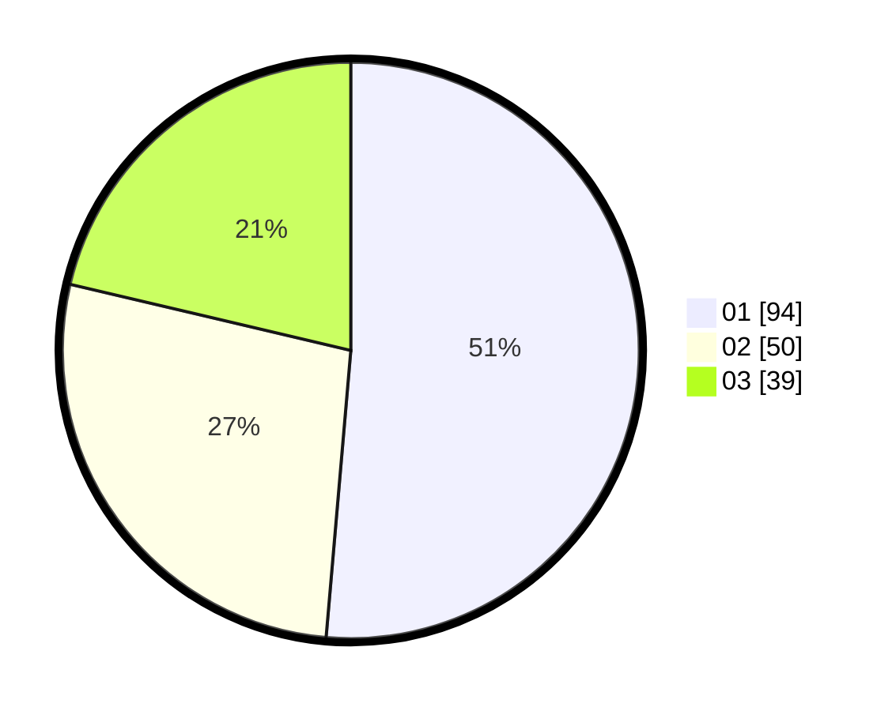

# Hasil

Hasil perolehan suara paslon dapat dilihat pada file paslon-01.txt, paslon-02.txt, dan paslon-03.txt.

Jika tidak ada, artinya data tersebut belum ada pada SIREKAP.

## Perolehan Suara

 * Paslon 01: **94**.
 * Paslon 02: **50**.
 * Paslon 03: **39**.

## Foto C Plano

https://sirekap-obj-formc.kpu.go.id/8eb9/pemilu/ppwp/31/73/02/10/04/3173021004036-20240214-222845--ee16bbba-7133-43b7-b5cb-ceece85a99cb.jpg

https://sirekap-obj-formc.kpu.go.id/8eb9/pemilu/ppwp/31/73/02/10/04/3173021004036-20240214-223156--4f97f5f8-daa6-4703-adf5-dda530affcce.jpg

https://sirekap-obj-formc.kpu.go.id/8eb9/pemilu/ppwp/31/73/02/10/04/3173021004036-20240215-000510--4727c6db-0ac4-47c8-8bca-9c42dabebf1c.jpg
