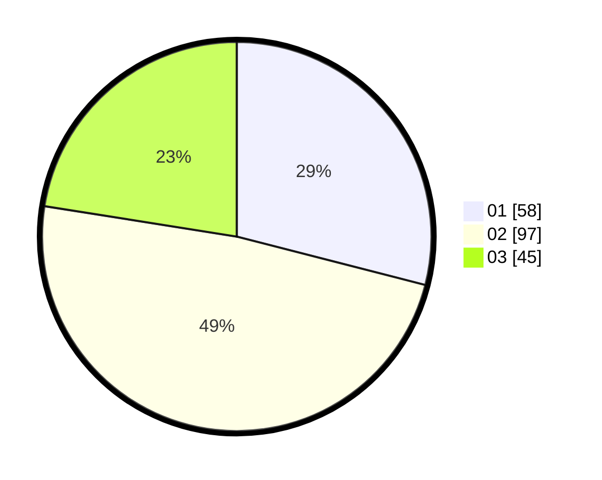

# Hasil

Hasil perolehan suara paslon dapat dilihat pada file paslon-01.txt, paslon-02.txt, dan paslon-03.txt.

Jika tidak ada, artinya data tersebut belum ada pada SIREKAP.

## Perolehan Suara

 * Paslon 01: **58**.
 * Paslon 02: **97**.
 * Paslon 03: **45**.

## Foto C Plano

https://sirekap-obj-formc.kpu.go.id/4cd3/pemilu/ppwp/31/73/02/10/04/3173021004041-20240215-000139--bb0542c1-252e-4bf4-9840-61e8d161f2a9.jpg

https://sirekap-obj-formc.kpu.go.id/4cd3/pemilu/ppwp/31/73/02/10/04/3173021004041-20240215-000229--ed78474e-00f3-412b-b8f5-89cfeff85497.jpg

https://sirekap-obj-formc.kpu.go.id/4cd3/pemilu/ppwp/31/73/02/10/04/3173021004041-20240215-000432--592c16a7-e9f5-4158-ad7b-5c17b081725e.jpg
