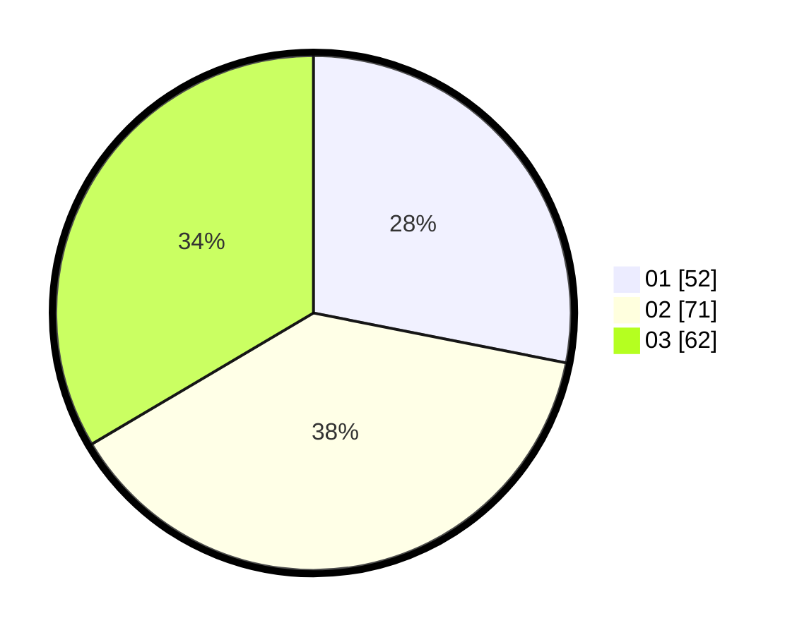

# Hasil

Hasil perolehan suara paslon dapat dilihat pada file paslon-01.txt, paslon-02.txt, dan paslon-03.txt.

Jika tidak ada, artinya data tersebut belum ada pada SIREKAP.

## Perolehan Suara

 * Paslon 01: **52**.
 * Paslon 02: **71**.
 * Paslon 03: **62**.

## Foto C Plano

https://sirekap-obj-formc.kpu.go.id/3dbb/pemilu/ppwp/31/73/02/10/04/3173021004054-20240217-164244--12807fef-333b-4325-afba-6e9b29dab5e5.jpg

https://sirekap-obj-formc.kpu.go.id/3dbb/pemilu/ppwp/31/73/02/10/04/3173021004054-20240217-164245--ff02df1c-a4da-4e4e-95da-b92a10874365.jpg

https://sirekap-obj-formc.kpu.go.id/3dbb/pemilu/ppwp/31/73/02/10/04/3173021004054-20240217-164245--b2cdf263-35eb-4f63-b7ba-cb6b59777440.jpg

## DATA PEMILIH TETAP

Jumlah pemilih dalam DPT: **235**.
 * L: **98**.
 * P: **137**.

## DATA PENGGUNA HAK PILIH

Jumlah pengguna hak pilih dalam DPT: **168**.
 * L: **69**.
 * P: **99**.

Jumlah pengguna hak pilih dalam DPTb: **6**.
 * L: **0**.
 * P: **6**.

Jumlah pengguna hak pilih dalam DPK: **2**.
 * L: **0**.
 * P: **2**.

Jumlah pengguna hak pilih: **176**.
 * L: **69**.
 * P: **107**.

## JUMLAH SUARA SAH DAN TIDAK SAH

JUMLAH SELURUH SUARA SAH: **0**.

JUMLAH SUARA TIDAK SAH: **0**.

JUMLAH SELURUH SUARA SAH DAN SUARA TIDAK SAH: **0**.
