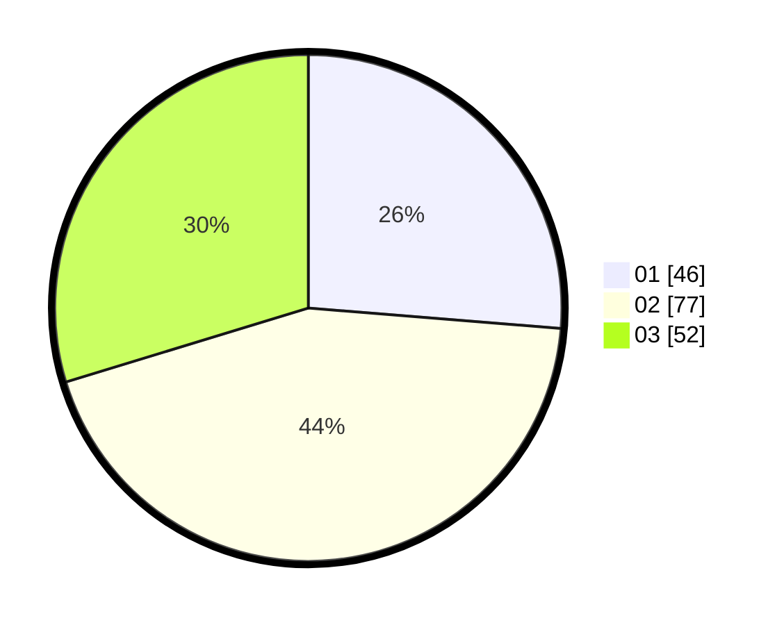

# Hasil

Hasil perolehan suara paslon dapat dilihat pada file paslon-01.txt, paslon-02.txt, dan paslon-03.txt.

Jika tidak ada, artinya data tersebut belum ada pada SIREKAP.

## Perolehan Suara

 * Paslon 01: **46**.
 * Paslon 02: **77**.
 * Paslon 03: **52**.

## Foto C Plano

https://sirekap-obj-formc.kpu.go.id/fdb8/pemilu/ppwp/31/73/02/10/04/3173021004056-20240215-232519--b444693e-887e-4c3f-8c31-5b88cf08a62a.jpg

https://sirekap-obj-formc.kpu.go.id/fdb8/pemilu/ppwp/31/73/02/10/04/3173021004056-20240215-232521--a3af5ba7-25b5-4a38-a6f3-ae68feef1107.jpg

https://sirekap-obj-formc.kpu.go.id/fdb8/pemilu/ppwp/31/73/02/10/04/3173021004056-20240215-232520--93857797-4449-44e4-87b8-da109b1af8c8.jpg

## DATA PEMILIH TETAP

Jumlah pemilih dalam DPT: **243**.
 * L: **132**.
 * P: **111**.

## DATA PENGGUNA HAK PILIH

Jumlah pengguna hak pilih dalam DPT: **171**.
 * L: **97**.
 * P: **74**.

Jumlah pengguna hak pilih dalam DPTb: **3**.
 * L: **1**.
 * P: **2**.

Jumlah pengguna hak pilih dalam DPK: **4**.
 * L: **0**.
 * P: **4**.

Jumlah pengguna hak pilih: **178**.
 * L: **98**.
 * P: **80**.

## JUMLAH SUARA SAH DAN TIDAK SAH

JUMLAH SELURUH SUARA SAH: **175**.

JUMLAH SUARA TIDAK SAH: **3**.

JUMLAH SELURUH SUARA SAH DAN SUARA TIDAK SAH: **178**.
