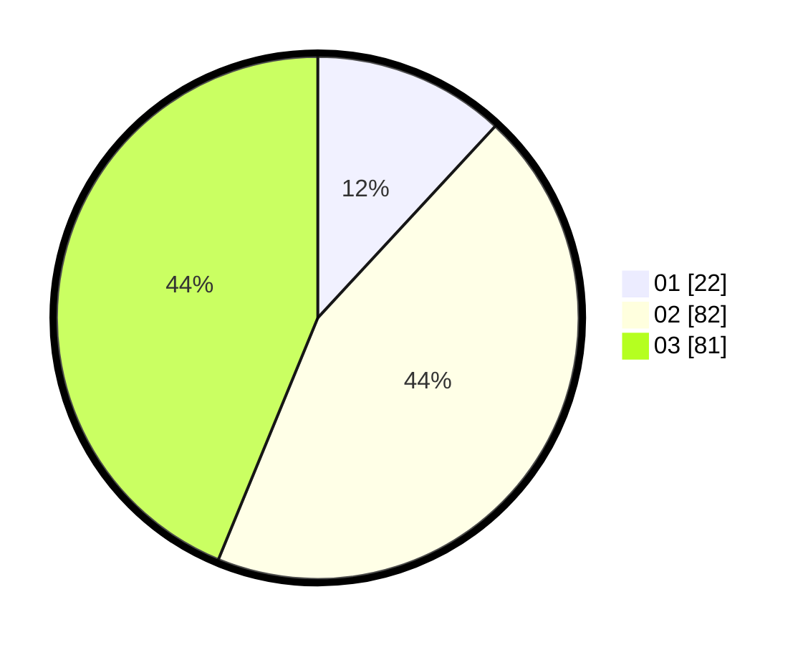

# Hasil

Hasil perolehan suara paslon dapat dilihat pada file paslon-01.txt, paslon-02.txt, dan paslon-03.txt.

Jika tidak ada, artinya data tersebut belum ada pada SIREKAP.

## Perolehan Suara

 * Paslon 01: **22**.
 * Paslon 02: **82**.
 * Paslon 03: **81**.

## Foto C Plano

https://sirekap-obj-formc.kpu.go.id/ed54/pemilu/ppwp/31/73/02/10/04/3173021004058-20240214-214546--8b961e64-a230-4564-b57b-42e7b102d3f3.jpg

https://sirekap-obj-formc.kpu.go.id/ed54/pemilu/ppwp/31/73/02/10/04/3173021004058-20240214-214721--913c97ca-a256-412b-912f-33eeef532ff7.jpg

https://sirekap-obj-formc.kpu.go.id/ed54/pemilu/ppwp/31/73/02/10/04/3173021004058-20240214-214902--13617682-de95-4cc5-aed1-8e23624b3214.jpg
