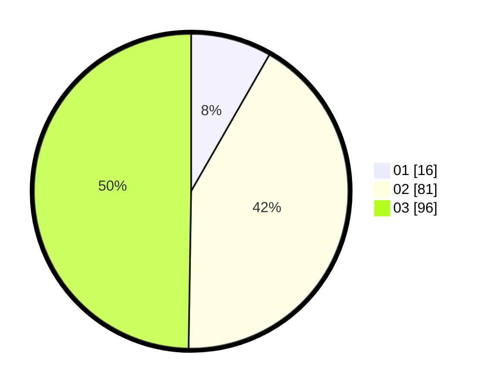

# Hasil

Hasil perolehan suara paslon dapat dilihat pada file paslon-01.txt, paslon-02.txt, dan paslon-03.txt.

Jika tidak ada, artinya data tersebut belum ada pada SIREKAP.

## Perolehan Suara

 * Paslon 01: **16**.
 * Paslon 02: **81**.
 * Paslon 03: **96**.

## Foto C Plano

https://sirekap-obj-formc.kpu.go.id/aa35/pemilu/ppwp/31/73/02/10/04/3173021004059-20240214-221925--95ff0c4e-fcec-4f2e-9c47-d877f0b8c427.jpg

https://sirekap-obj-formc.kpu.go.id/aa35/pemilu/ppwp/31/73/02/10/04/3173021004059-20240214-221936--c4e4fbfa-5df7-4395-b39d-e5b71ff86de8.jpg

https://sirekap-obj-formc.kpu.go.id/aa35/pemilu/ppwp/31/73/02/10/04/3173021004059-20240214-221944--1ca6b07c-50bf-4d33-80d2-d45ad514034e.jpg
