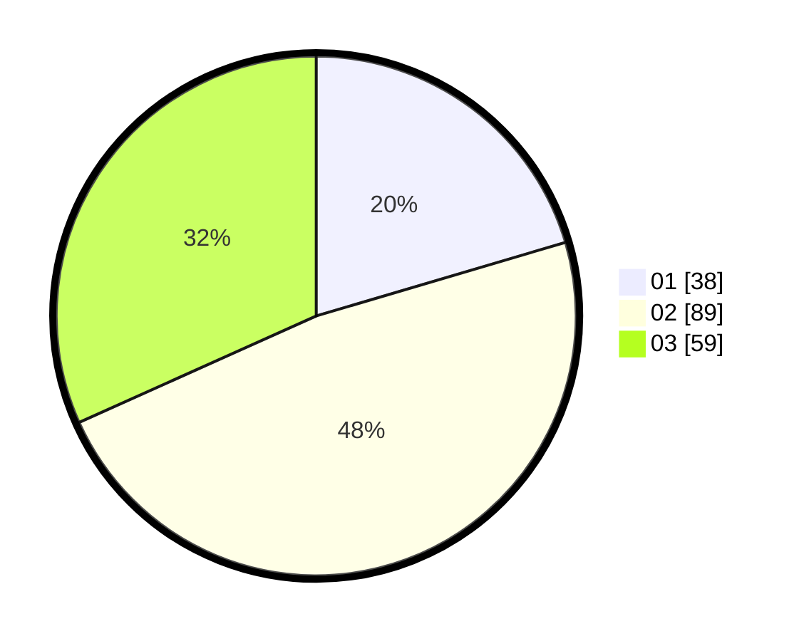

# Hasil

Hasil perolehan suara paslon dapat dilihat pada file paslon-01.txt, paslon-02.txt, dan paslon-03.txt.

Jika tidak ada, artinya data tersebut belum ada pada SIREKAP.

## Perolehan Suara

 * Paslon 01: **38**.
 * Paslon 02: **89**.
 * Paslon 03: **59**.

## Foto C Plano

https://sirekap-obj-formc.kpu.go.id/9948/pemilu/ppwp/31/73/02/10/04/3173021004066-20240214-190412--14838b86-3a68-426a-9d51-a9fa4af1c8a0.jpg

https://sirekap-obj-formc.kpu.go.id/9948/pemilu/ppwp/31/73/02/10/04/3173021004066-20240214-203726--043ac52b-e44e-4c44-a017-9a47197379ec.jpg

https://sirekap-obj-formc.kpu.go.id/9948/pemilu/ppwp/31/73/02/10/04/3173021004066-20240214-190914--9b8c5684-29e9-45ee-bbdc-3226af52c02e.jpg

## DATA PEMILIH TETAP

Jumlah pemilih dalam DPT: **285**.
 * L: **137**.
 * P: **148**.

## DATA PENGGUNA HAK PILIH

Jumlah pengguna hak pilih dalam DPT: **185**.
 * L: **88**.
 * P: **97**.

Jumlah pengguna hak pilih dalam DPTb: **0**.
 * L: **0**.
 * P: **0**.

Jumlah pengguna hak pilih dalam DPK: **5**.
 * L: **1**.
 * P: **4**.

Jumlah pengguna hak pilih: **190**.
 * L: **89**.
 * P: **101**.

## JUMLAH SUARA SAH DAN TIDAK SAH

JUMLAH SELURUH SUARA SAH: **186**.

JUMLAH SUARA TIDAK SAH: **4**.

JUMLAH SELURUH SUARA SAH DAN SUARA TIDAK SAH: **190**.
