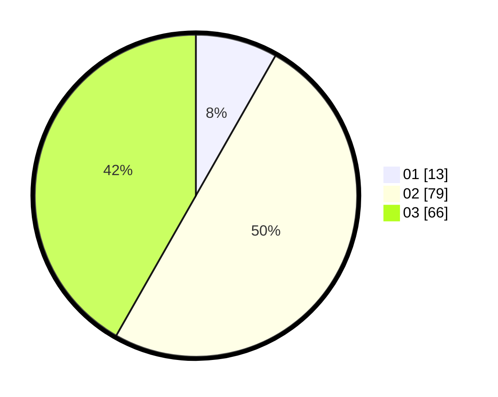

# Hasil

Hasil perolehan suara paslon dapat dilihat pada file paslon-01.txt, paslon-02.txt, dan paslon-03.txt.

Jika tidak ada, artinya data tersebut belum ada pada SIREKAP.

## Perolehan Suara

 * Paslon 01: **13**.
 * Paslon 02: **79**.
 * Paslon 03: **66**.

## Foto C Plano

https://sirekap-obj-formc.kpu.go.id/00cb/pemilu/ppwp/31/73/02/10/04/3173021004067-20240214-195648--e667fd97-db03-468e-8e8e-04251d0505a8.jpg

https://sirekap-obj-formc.kpu.go.id/00cb/pemilu/ppwp/31/73/02/10/04/3173021004067-20240214-190149--c9964657-fa32-443f-9712-bcfe9e6f9ad2.jpg

https://sirekap-obj-formc.kpu.go.id/00cb/pemilu/ppwp/31/73/02/10/04/3173021004067-20240214-185855--9803b18b-234e-4d36-9780-1c2e811ac315.jpg

## DATA PEMILIH TETAP

Jumlah pemilih dalam DPT: **229**.
 * L: **109**.
 * P: **120**.

## DATA PENGGUNA HAK PILIH

Jumlah pengguna hak pilih dalam DPT: **146**.
 * L: **68**.
 * P: **78**.

Jumlah pengguna hak pilih dalam DPTb: **11**.
 * L: **9**.
 * P: **2**.

Jumlah pengguna hak pilih dalam DPK: **1**.
 * L: **0**.
 * P: **1**.

Jumlah pengguna hak pilih: **158**.
 * L: **77**.
 * P: **81**.

## JUMLAH SUARA SAH DAN TIDAK SAH

JUMLAH SELURUH SUARA SAH: **158**.

JUMLAH SUARA TIDAK SAH: **1**.

JUMLAH SELURUH SUARA SAH DAN SUARA TIDAK SAH: **159**.
