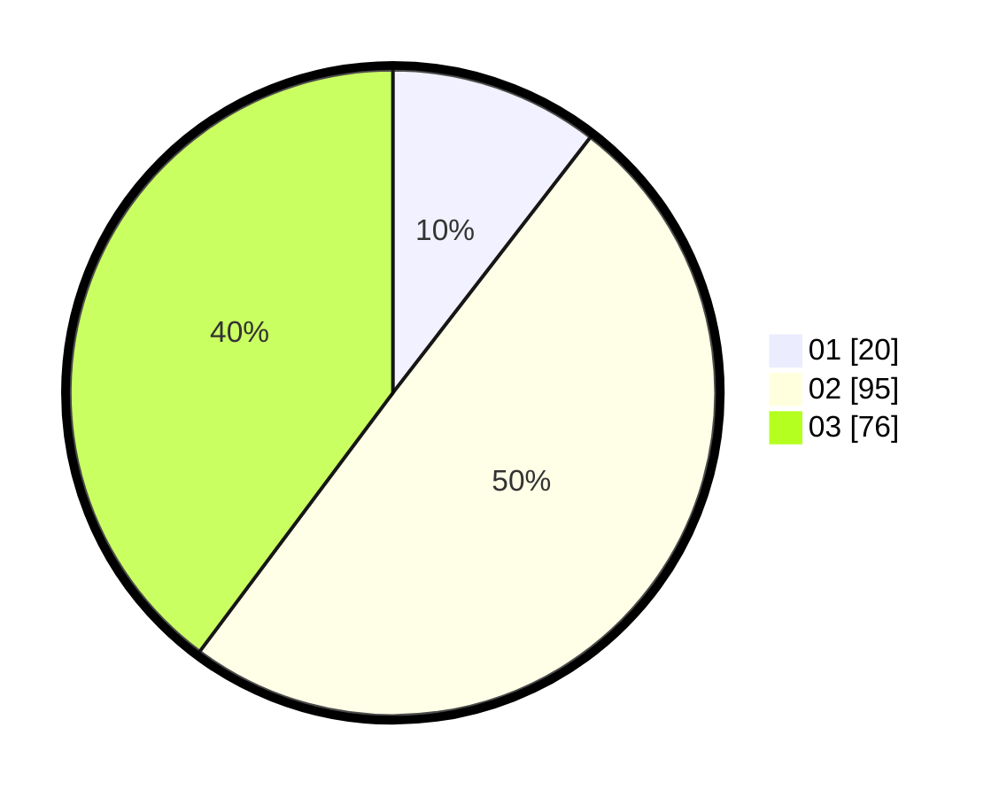

# Hasil

Hasil perolehan suara paslon dapat dilihat pada file paslon-01.txt, paslon-02.txt, dan paslon-03.txt.

Jika tidak ada, artinya data tersebut belum ada pada SIREKAP.

## Perolehan Suara

 * Paslon 01: **20**.
 * Paslon 02: **95**.
 * Paslon 03: **76**.

## Foto C Plano

https://sirekap-obj-formc.kpu.go.id/03d2/pemilu/ppwp/31/73/02/10/04/3173021004068-20240215-221031--5edc0dcc-5d8b-48bb-90ed-eac0f55a0cac.jpg

https://sirekap-obj-formc.kpu.go.id/03d2/pemilu/ppwp/31/73/02/10/04/3173021004068-20240215-221033--8ba9c222-1703-4ab4-8e56-1289839411df.jpg

https://sirekap-obj-formc.kpu.go.id/03d2/pemilu/ppwp/31/73/02/10/04/3173021004068-20240215-221032--af837536-e3d2-4da2-8be4-a61d9b377eb3.jpg

## DATA PEMILIH TETAP

Jumlah pemilih dalam DPT: **276**.
 * L: **131**.
 * P: **145**.

## DATA PENGGUNA HAK PILIH

Jumlah pengguna hak pilih dalam DPT: **191**.
 * L: **89**.
 * P: **102**.

Jumlah pengguna hak pilih dalam DPTb: **0**.
 * L: **0**.
 * P: **0**.

Jumlah pengguna hak pilih dalam DPK: **5**.
 * L: **2**.
 * P: **3**.

Jumlah pengguna hak pilih: **196**.
 * L: **91**.
 * P: **105**.

## JUMLAH SUARA SAH DAN TIDAK SAH

JUMLAH SELURUH SUARA SAH: **191**.

JUMLAH SUARA TIDAK SAH: **5**.

JUMLAH SELURUH SUARA SAH DAN SUARA TIDAK SAH: **196**.
