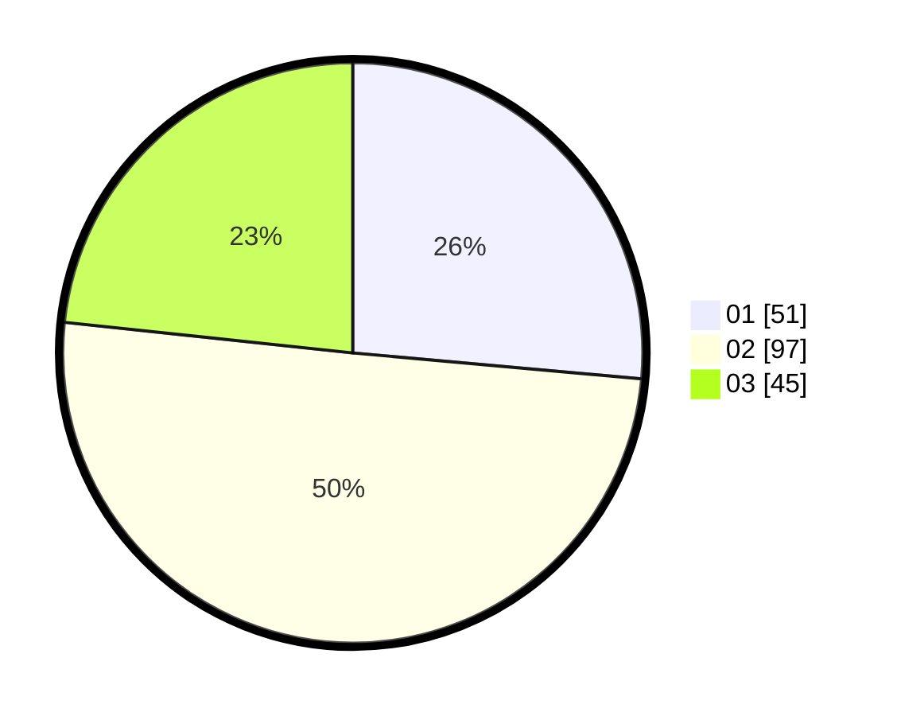

# Hasil

Hasil perolehan suara paslon dapat dilihat pada file paslon-01.txt, paslon-02.txt, dan paslon-03.txt.

Jika tidak ada, artinya data tersebut belum ada pada SIREKAP.

## Perolehan Suara

 * Paslon 01: **51**.
 * Paslon 02: **97**.
 * Paslon 03: **45**.

## Foto C Plano

https://sirekap-obj-formc.kpu.go.id/c394/pemilu/ppwp/31/73/02/10/04/3173021004069-20240214-200300--8a8e6eec-f2db-421a-adb5-12795067373a.jpg

https://sirekap-obj-formc.kpu.go.id/c394/pemilu/ppwp/31/73/02/10/04/3173021004069-20240214-200307--17e55fde-68d7-4eb0-b313-d83915c7a757.jpg

https://sirekap-obj-formc.kpu.go.id/c394/pemilu/ppwp/31/73/02/10/04/3173021004069-20240214-200313--c157d803-c31f-4f9c-90dd-f631fbf0b1e3.jpg

## DATA PEMILIH TETAP

Jumlah pemilih dalam DPT: **248**.
 * L: **127**.
 * P: **121**.

## DATA PENGGUNA HAK PILIH

Jumlah pengguna hak pilih dalam DPT: **192**.
 * L: **96**.
 * P: **96**.

Jumlah pengguna hak pilih dalam DPTb: **0**.
 * L: **0**.
 * P: **0**.

Jumlah pengguna hak pilih dalam DPK: **4**.
 * L: **2**.
 * P: **2**.

Jumlah pengguna hak pilih: **196**.
 * L: **98**.
 * P: **98**.

## JUMLAH SUARA SAH DAN TIDAK SAH

JUMLAH SELURUH SUARA SAH: **193**.

JUMLAH SUARA TIDAK SAH: **3**.

JUMLAH SELURUH SUARA SAH DAN SUARA TIDAK SAH: **196**.
