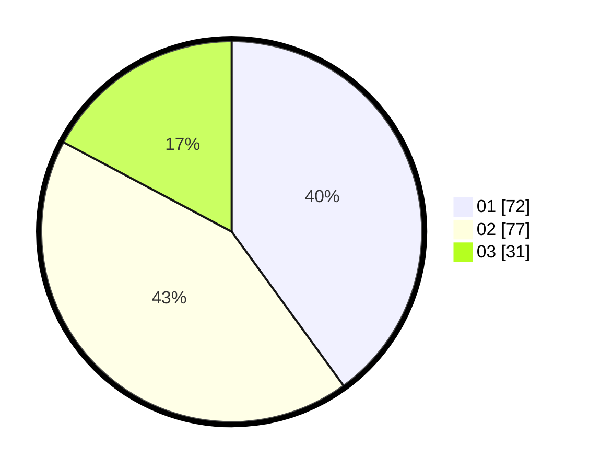

# Hasil

Hasil perolehan suara paslon dapat dilihat pada file paslon-01.txt, paslon-02.txt, dan paslon-03.txt.

Jika tidak ada, artinya data tersebut belum ada pada SIREKAP.

## Perolehan Suara

 * Paslon 01: **72**.
 * Paslon 02: **77**.
 * Paslon 03: **31**.

## Foto C Plano

https://sirekap-obj-formc.kpu.go.id/4baf/pemilu/ppwp/31/73/02/10/04/3173021004070-20240215-013102--4048e7c8-678d-43c0-b633-08bef89aeb29.jpg

https://sirekap-obj-formc.kpu.go.id/4baf/pemilu/ppwp/31/73/02/10/04/3173021004070-20240215-013349--51acd887-8e78-4956-ac16-1ed958b84bd9.jpg

https://sirekap-obj-formc.kpu.go.id/4baf/pemilu/ppwp/31/73/02/10/04/3173021004070-20240215-013535--a2c9def5-196c-4ba2-9267-c47d05a230b2.jpg

## DATA PEMILIH TETAP

Jumlah pemilih dalam DPT: **242**.
 * L: **774**.
 * P: **278**.

## DATA PENGGUNA HAK PILIH

Jumlah pengguna hak pilih dalam DPT: **378**.
 * L: **84**.
 * P: **94**.

Jumlah pengguna hak pilih dalam DPTb: **277**.
 * L: **888**.
 * P: **782**.

Jumlah pengguna hak pilih dalam DPK: **3**.
 * L: **6**.
 * P: **2**.

Jumlah pengguna hak pilih: **181**.
 * L: **885**.
 * P: **96**.

## JUMLAH SUARA SAH DAN TIDAK SAH

JUMLAH SELURUH SUARA SAH: **180**.

JUMLAH SUARA TIDAK SAH: **1**.

JUMLAH SELURUH SUARA SAH DAN SUARA TIDAK SAH: **181**.
