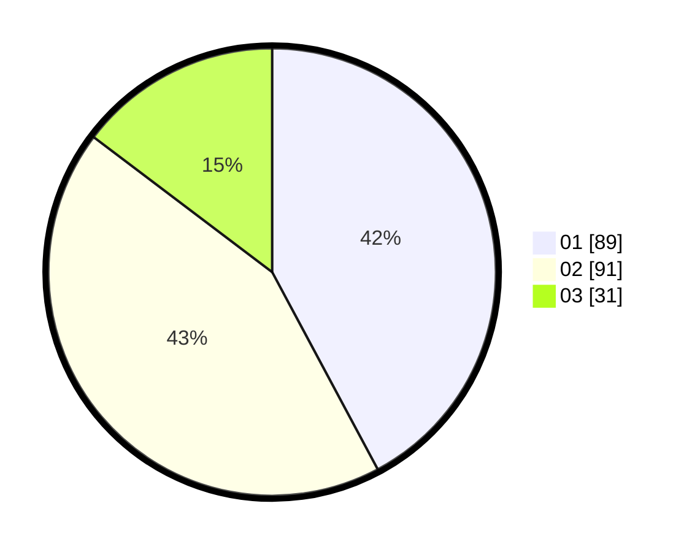

# Hasil

Hasil perolehan suara paslon dapat dilihat pada file paslon-01.txt, paslon-02.txt, dan paslon-03.txt.

Jika tidak ada, artinya data tersebut belum ada pada SIREKAP.

## Perolehan Suara

 * Paslon 01: **89**.
 * Paslon 02: **91**.
 * Paslon 03: **31**.

## Foto C Plano

https://sirekap-obj-formc.kpu.go.id/355a/pemilu/ppwp/31/73/02/10/04/3173021004071-20240214-231741--83afdb07-936d-4c8a-aac0-33d1214a2648.jpg

https://sirekap-obj-formc.kpu.go.id/355a/pemilu/ppwp/31/73/02/10/04/3173021004071-20240214-231808--2c640d2c-ac8b-4aa0-92d4-ddf3dbbe3cca.jpg

https://sirekap-obj-formc.kpu.go.id/355a/pemilu/ppwp/31/73/02/10/04/3173021004071-20240214-205714--ae680740-0f4f-487a-8d3f-6b427d28b61d.jpg

## DATA PEMILIH TETAP

Jumlah pemilih dalam DPT: **264**.
 * L: **133**.
 * P: **131**.

## DATA PENGGUNA HAK PILIH

Jumlah pengguna hak pilih dalam DPT: **209**.
 * L: **98**.
 * P: **111**.

Jumlah pengguna hak pilih dalam DPTb: **2**.
 * L: **2**.
 * P: **0**.

Jumlah pengguna hak pilih dalam DPK: **3**.
 * L: **1**.
 * P: **2**.

Jumlah pengguna hak pilih: **214**.
 * L: **101**.
 * P: **113**.

## JUMLAH SUARA SAH DAN TIDAK SAH

JUMLAH SELURUH SUARA SAH: **211**.

JUMLAH SUARA TIDAK SAH: **3**.

JUMLAH SELURUH SUARA SAH DAN SUARA TIDAK SAH: **214**.
